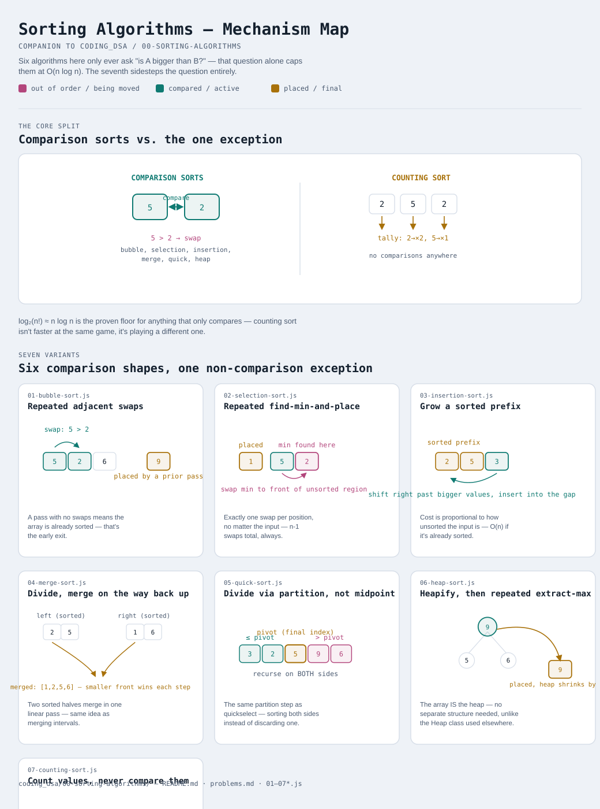

# Sorting Algorithms

Interactive version: [diagram.html](diagram.html) (open in a browser)

## What
- Prerequisite knowledge, not one of the 27 interview patterns — the
  patterns assume you already know what "sort by X first" costs and
  guarantees, so this module comes before all of them
- Six comparison-based sorts (bubble, selection, insertion, merge, quick,
  heap) and one non-comparison sort (counting) — each with a genuinely
  different mechanism, not just a different name for the same loop

## When to use which
1. **Nearly-sorted or streaming data** → insertion sort. O(n) best case,
   and it naturally extends to "insert one new element into an
   already-sorted collection"
2. **Guaranteed O(n log n), stability required, memory is not a concern**
   → merge sort
3. **Fast in practice, memory is tight, worst case is acceptable risk** →
   quick sort (in-place, but O(n²) on adversarial input)
4. **O(n log n) worst-case AND in-place** → heap sort — the only
   comparison sort here with both properties at once, at the cost of
   losing stability
5. **Values are integers in a small known range** → counting sort, O(n+k)
   — faster than any comparison sort can ever be, but only because it
   isn't playing the same game
6. **Teaching, or n is tiny** → bubble/selection sort — simple to reason
   about, never the right choice for real workloads

## Why comparison sorts can't beat O(n log n)
- A comparison sort's only source of information is "is A bigger than B?"
  — with n elements there are n! possible orderings, and each comparison
  can rule out at most half the remaining possibilities
- log₂(n!) is Θ(n log n) — that's the proven floor for ANY algorithm that
  only compares elements, no matter how cleverly
- Counting sort (variant 7) sidesteps this floor entirely by never
  comparing anything — it counts, which is a fundamentally different
  operation the bound doesn't apply to

## Seven variants

| File | Variant | Time | Space | Stable | In-place |
|---|---|---|---|---|---|
| [01-bubble-sort.js](01-bubble-sort.js) | Repeated adjacent swaps | O(n²) | O(1) | yes | yes |
| [02-selection-sort.js](02-selection-sort.js) | Repeated find-min-and-place | O(n²) | O(1) | no | yes |
| [03-insertion-sort.js](03-insertion-sort.js) | Grow a sorted prefix | O(n²), O(n) best | O(1) | yes | yes |
| [04-merge-sort.js](04-merge-sort.js) | Divide, merge on the way back up | O(n log n) | O(n) | yes | no |
| [05-quick-sort.js](05-quick-sort.js) | Divide via partition, not midpoint | O(n log n) avg, O(n²) worst | O(1) | no | yes |
| [06-heap-sort.js](06-heap-sort.js) | Heapify, then repeated extract-max | O(n log n) | O(1) | no | yes |
| [07-counting-sort.js](07-counting-sort.js) | Count values, never compare them | O(n+k) | O(k) | yes | no |

Each file is runnable standalone: `node 0X-name.js` prints a demo run.

**Where this connects to the patterns ahead:** [04-merge-intervals](../04-merge-intervals/README.md)
and [05-cyclic-sort](../05-cyclic-sort/README.md) both lean on sorting as a
first step; [02-two-pointers/11-pivot-partition.js](../02-two-pointers/11-pivot-partition.js)
reuses variant 5's exact partition step for quickselect instead of a full sort.

See [problems.md](problems.md) for a suggested practice order.
