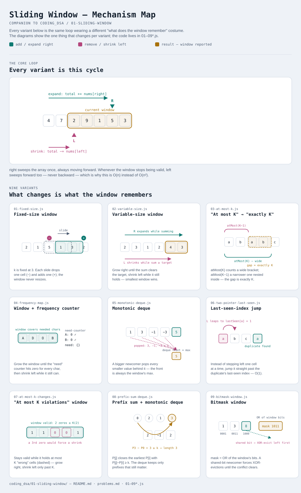

# Sliding Window

Interactive version: [diagram.html](diagram.html) (open in a browser) · [hosted copy](https://claude.ai/code/artifact/16a6d1b3-54e1-4006-b9c6-436322b55851)

## What
- Solves problems over **contiguous** subarrays/substrings
- Replaces brute-force nested loops (`O(n²)` or `O(n·k)`) with one pass (`O(n)`)
- Reuses work between consecutive windows: add the element entering, remove
  the element leaving, instead of recomputing from scratch

## When to use it
Applies only if all three are true:
1. The answer is about a **contiguous** run (subarray / substring / sublist)
   — not contiguous → think subsets/DP instead
2. Growing the window moves some measurable property monotonically in one
   direction (sum, count, distinct-count)
3. "Add element" and "remove element" both update the running state in O(1)
   (or O(log n) with a heap/deque)

**Watch out:**
- Negative numbers + a sum condition → sum stops being monotonic as the
  window grows, so plain sliding window breaks
- Use prefix sum + hashmap/deque instead (see [08-prefix-sum-deque.js](08-prefix-sum-deque.js))

## Why it works
- `left` only ever moves forward, never resets
- Each element is added to the window once and removed at most once
- Total work across the whole pass is O(n), even though the code looks like
  a nested loop (`for` + `while`)

## Variants in this folder

| File | Variant | Use when |
|---|---|---|
| [01-fixed-size.js](01-fixed-size.js) | Fixed-size window | window size `k` is given up front |
| [02-variable-size.js](02-variable-size.js) | Expand/shrink window | no fixed `k`; grow while valid, shrink while invalid |
| [03-at-most-k.js](03-at-most-k.js) | "At most K" → "exactly K" trick | counting problems where `exactly(K) = atMost(K) - atMost(K-1)` |
| [04-frequency-map.js](04-frequency-map.js) | Window + frequency counter | matching against a target char/element distribution (anagrams, min-window-substring) |
| [05-monotonic-deque.js](05-monotonic-deque.js) | Monotonic deque | need window max/min fast — sum-style incremental update doesn't work for max/min |
| [06-two-pointer-last-seen.js](06-two-pointer-last-seen.js) | Last-seen-index jump | violation has one identifiable cause, so `left` can jump directly instead of stepping one at a time |
| [07-at-most-k-changes.js](07-at-most-k-changes.js) | "At most K changes/violations" window | longest substring/subarray where up to K elements may be "wrong" (char replacement, flip zeros) |
| [08-prefix-sum-deque.js](08-prefix-sum-deque.js) | Prefix-sum + monotonic deque | sum-based window but array contains **negative** numbers, so plain sum isn't monotonic anymore |
| [09-bitmask-window.js](09-bitmask-window.js) | Bitmask window (OR / XOR-parity) | window/prefix state is a handful of booleans — "no shared bits" or "even/odd count per category" — packed into one integer |

Each file is runnable standalone: `node 0X-name.js` prints a demo run.

See [problems.md](problems.md) for a suggested practice order.
