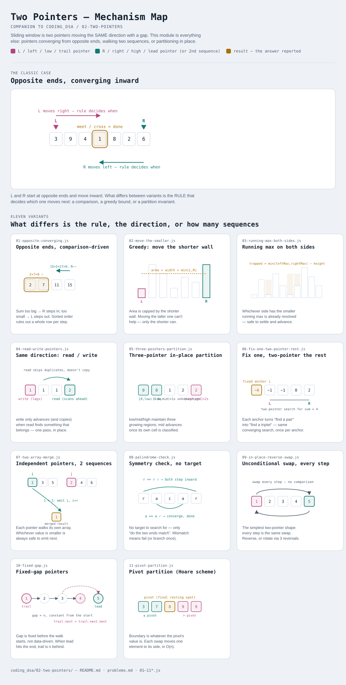

# Two Pointers

Interactive version: [diagram.html](diagram.html) (open in a browser)

## What
- Two indices walk across one or two sequences instead of one index looping
  over nested ranges
- Replaces brute-force pair/triplet checks (`O(n²)` or `O(n³)`) with a single
  pass or two (`O(n)` or `O(n log n)` after a sort)
- Each pointer move is justified by an invariant, not tried-and-checked — that
  invariant is the thing that changes between variants

## When to use it
Applies when:
1. The problem is about **pairs, triplets, or a single sequence read twice**
   (from both ends, or at two speeds) — not arbitrary subsets
2. There's a **provable rule** for which pointer moves next (sorted order,
   a greedy bound, a partition invariant) — without one, you're just guessing
   and it degrades back to brute force
3. Sorting first is acceptable, if the problem doesn't already give sorted input
   (sorting costs O(n log n) but unlocks the two-pointer O(n) scan after it)

**Not covered here:** fast/slow pointers moving at *different speeds* through
the *same* structure (cycle detection, middle-of-list) live in their own
module — see [../index.md](../index.md) `03-fast-slow-pointers`.

**Relationship to Sliding Window:** sliding window is technically two pointers
moving in the *same* direction with a variable gap between them. This module
covers pointers that converge from opposite ends, move independently across
two different sequences, or partition in place — shapes sliding window doesn't
cover. See [../01-sliding-window](../01-sliding-window/README.md) for the
same-direction-with-a-window family.

## Why it works
- Every variant relies on discarding one candidate (or resolving one cell) per
  pointer step, backed by a proof that nothing "left behind" needed re-checking
- No pointer ever moves backward, so total work stays linear in the input size

## Variants in this folder

| File | Variant | Use when |
|---|---|---|
| [01-opposite-converging.js](01-opposite-converging.js) | Opposite ends, comparison-driven | sorted array, searching for a pair matching a target |
| [02-move-the-smaller.js](02-move-the-smaller.js) | Opposite ends, greedy "move the smaller side" | answer is capped by the shorter of two current boundaries |
| [03-running-max-both-sides.js](03-running-max-both-sides.js) | Opposite ends, pointers carry running state | answer at each position depends on the max/min seen so far from both sides |
| [04-read-write-pointers.js](04-read-write-pointers.js) | Same direction, read/write | compact or filter an array in place without extra space |
| [05-three-pointers-partition.js](05-three-pointers-partition.js) | Three pointers, in-place partition | classify every element into one of 3 fixed buckets in one pass |
| [06-fix-one-two-pointer-rest.js](06-fix-one-two-pointer-rest.js) | Fix one index + two-pointer on the rest | k-sum problems (3Sum, 4Sum) — reduces to (k−1)-sum |
| [07-two-array-merge.js](07-two-array-merge.js) | Independent pointers on two sequences | merging two sorted inputs, or checking one is a subsequence of the other |
| [08-palindrome-check.js](08-palindrome-check.js) | Opposite ends, symmetry check | verifying a sequence mirrors itself, with optional one-mismatch tolerance |
| [09-in-place-reverse-swap.js](09-in-place-reverse-swap.js) | Opposite ends, unconditional swap | reversing or rotating a sequence in place |
| [10-fixed-gap.js](10-fixed-gap.js) | Fixed-gap pointers | the distance between pointers is set up front and stays constant, not data-driven |
| [11-pivot-partition.js](11-pivot-partition.js) | Pivot partition (Hoare scheme) | swap decisions driven by comparison to a pivot value — quickselect, quicksort |

Each file is runnable standalone: `node 0X-name.js` prints a demo run.

See [problems.md](problems.md) for a suggested practice order.
