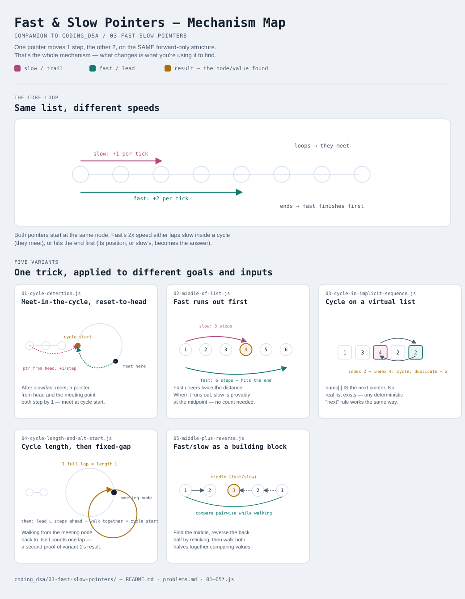

# Fast & Slow Pointers

Interactive version: [diagram.html](diagram.html) (open in a browser)

## What
- Two pointers walk the **same** structure at **different speeds** (typically
  1 step vs 2 steps), instead of starting at opposite ends or on two structures
- Used for two unrelated jobs that happen to share one mechanic: detecting a
  **cycle**, and finding the **midpoint** without counting length first
- Also called Floyd's tortoise and hare, mainly for the cycle-detection half

## When to use it
Applies when:
1. The structure can only be walked **forward**, one link at a time (a linked
   list, or a sequence defined by "apply this function to get the next value")
   — no random access, so you can't just jump to index n/2
2. You need either "does this loop forever" or "where's the middle", **in one
   pass and O(1) extra space** — the alternative is a hashset of visited nodes
   (also O(n) time but O(n) space) or counting the length first (needs two passes)

**Not covered here:** pointers from opposite ends of an array/string, or at a
*fixed* gap set up front — that's [../02-two-pointers](../02-two-pointers/README.md).
This module is specifically about a *speed difference* on a single forward-only walk.

## Why it works
- Fast gains exactly 1 node of lead on slow every step
- If the structure is finite and acyclic, fast simply reaches the end first —
  slow's position when that happens is deterministic (variant 2)
- If the structure loops, fast eventually re-enters the same territory slow is
  in and the 1-node-per-step gain guarantees a meeting, since the gap between
  them (mod cycle length) decreases by exactly 1 each step until it hits 0

## Only 5 variants — and that's the honest count
Unlike sliding window (9) or two pointers (11), this pattern doesn't have many
genuinely different mechanisms — it's really one trick (differential speed)
applied to a few different goals and a couple of non-obvious inputs. Padding
the count would misrepresent how much there is to learn here.

| File | Variant | Use when |
|---|---|---|
| [01-cycle-detection.js](01-cycle-detection.js) | Meet-in-the-cycle, then reset-to-head | does a list cycle, and if so, where does the cycle start |
| [02-middle-of-list.js](02-middle-of-list.js) | Fast runs out first | find the midpoint of a list in one pass, no length count |
| [03-cycle-in-implicit-sequence.js](03-cycle-in-implicit-sequence.js) | Cycle detection on a virtual list | the "next" pointer is a function/rule, not a real `.next` (digit-square sums, array-as-graph) |
| [04-cycle-length-and-alt-start.js](04-cycle-length-and-alt-start.js) | Cycle length, then fixed-gap | need the cycle's length; or want to relocate its start via [02-two-pointers](../02-two-pointers/10-fixed-gap.js)'s technique instead of variant 1's |
| [05-middle-plus-reverse.js](05-middle-plus-reverse.js) | Fast/slow as a building block | composed with reversal + comparison to solve a bigger problem (palindrome check) |

Each file is runnable standalone: `node 0X-name.js` prints a demo run.

See [problems.md](problems.md) for a suggested practice order.
