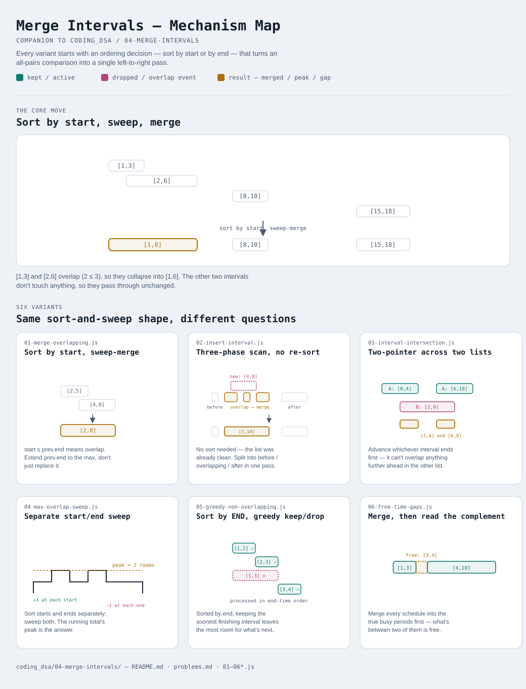

# Merge Intervals

Interactive version: [diagram.html](diagram.html) (open in a browser)

## What
- Problems about ranges `[start, end]` that need combining, comparing, or
  counting against each other
- Almost every variant starts the same way — **sort**, then make one
  left-to-right pass — but what you sort by and what you track differs
- Not about a single pointer technique; it's about the ordering insight that
  makes a single pass sufficient at all

## When to use it
Applies when:
1. The input is a set of `[start, end]` ranges (times, positions, versions —
   anything with an ordered span)
2. The question is about **overlap**: union (variant 1), intersection
   (variant 3), concurrent count (variant 4), or the absence of overlap
   (variant 5, variant 6)
3. Sorting first turns an apparent O(n²) all-pairs comparison into an O(n log n)
   sort + O(n) sweep — the sort is what guarantees nothing gets missed by only
   looking at neighbors

## Why it works
- Sorting establishes an order where **only adjacent elements can conflict**
  after processing everything before them — an unsorted approach would have
  to compare every pair
- What you sort by is the load-bearing decision: by **start** for merging/
  scanning in time order (variants 1, 2, 3, 4, 6), by **end** for greedy
  keep/drop decisions (variant 5) — mixing these up silently breaks the proof

## Six variants — not a round number, on purpose
Same principle as [../03-fast-slow-pointers](../03-fast-slow-pointers/README.md):
the count reflects how many genuinely different mechanisms exist here, not a
target to hit.

| File | Variant | Use when |
|---|---|---|
| [01-merge-overlapping.js](01-merge-overlapping.js) | Sort by start, sweep-merge | collapse overlapping intervals into their union |
| [02-insert-interval.js](02-insert-interval.js) | Three-phase scan, no re-sort | input is already sorted/merged; only inserting one new interval |
| [03-interval-intersection.js](03-interval-intersection.js) | Two-pointer across two lists | find every overlap between two independent interval lists |
| [04-max-overlap-sweep.js](04-max-overlap-sweep.js) | Separate start/end sweep | count concurrent overlap at the busiest moment, not the union |
| [05-greedy-non-overlapping.js](05-greedy-non-overlapping.js) | Sort by END, greedy keep/drop | minimum removals to make a set of intervals non-overlapping |
| [06-free-time-gaps.js](06-free-time-gaps.js) | Merge, then read the complement | the answer is the gaps BETWEEN intervals, not the intervals |

Each file is runnable standalone: `node 0X-name.js` prints a demo run.

See [problems.md](problems.md) for a suggested practice order.
