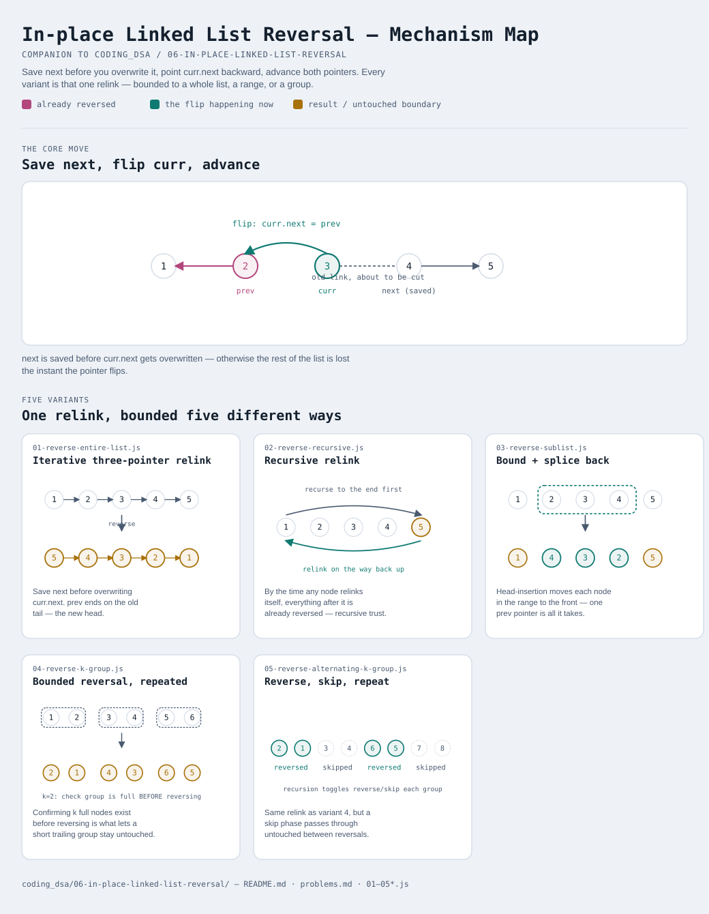

# In-place Linked List Reversal

Interactive version: [diagram.html](diagram.html) (open in a browser)

## What
- Flip the direction of `.next` pointers across a whole list or a bounded
  segment of one, without allocating a new list or an array copy
- Every variant is the same core relink (save `next`, point `.next`
  backward, advance) — what changes is **how much** of the list gets relinked
  and **how the untouched parts reconnect** afterward

## When to use it
Applies when:
1. The structure is a **singly linked list** — no backward pointer to lean
   on, so "reverse" has to physically rewrite links, not just read them differently
2. The problem needs **O(1) extra space** — copying values into an array,
   reversing the array, and writing them back is O(n) space and defeats the
   point of doing it on a linked list at all
3. Only part of the list may need reversing (variants 3–5) — which means
   correctly reconnecting the reversed piece to whatever wasn't touched
   matters as much as the reversal itself

## Why it works
- Three references are always enough: the node being relinked, the node
  before it (where it must now point), and the node after it (saved before
  the overwrite, or the list is lost)
- Reversing a bounded segment only requires knowing where it starts (a
  `prev`/`dummy` pointer) — moving each subsequent node to the FRONT of the
  segment ("head insertion") reverses it using that single reference, with
  no separate bookkeeping for the segment's original head and tail

## Five variants — the honest count
Same principle as the last few modules: one relinking idea, read a few
different ways. No padding to hit a round number.

| File | Variant | Use when |
|---|---|---|
| [01-reverse-entire-list.js](01-reverse-entire-list.js) | Iterative three-pointer relink | reverse the whole list, O(1) space |
| [02-reverse-recursive.js](02-reverse-recursive.js) | Recursive relink | same result, relinking happens unwinding the call stack instead of walking forward |
| [03-reverse-sublist.js](03-reverse-sublist.js) | Bound + splice back | reverse only nodes `[left, right]`, reconnect both untouched ends |
| [04-reverse-k-group.js](04-reverse-k-group.js) | Bounded reversal, repeated | reverse every fixed-size group of k; a short trailing group stays as-is |
| [05-reverse-alternating-k-group.js](05-reverse-alternating-k-group.js) | Reverse, skip, repeat | reverse every OTHER group of k, leaving the rest untouched |

Each file is runnable standalone: `node 0X-name.js` prints a demo run.

**Related composition:** [03-fast-slow-pointers/05-middle-plus-reverse.js](../03-fast-slow-pointers/05-middle-plus-reverse.js)
uses variant 1's reversal as a building block (find the middle, reverse the
back half, compare) to check whether a list is a palindrome — worth
revisiting once this module's basics are solid.

See [problems.md](problems.md) for a suggested practice order.
