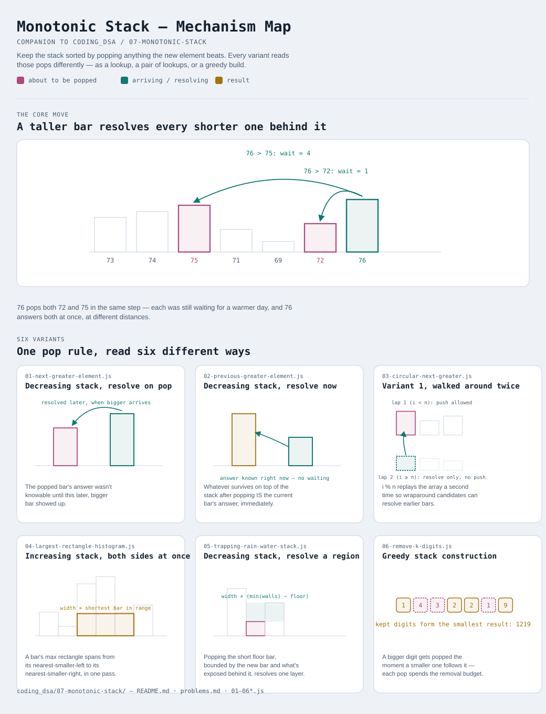

# Monotonic Stack

Interactive version: [diagram.html](diagram.html) (open in a browser)

## What
- A stack that's kept sorted (always increasing or always decreasing,
  top-to-bottom) by popping anything that would break that order before
  pushing the new element
- The popping isn't cleanup — it's the answer. Whatever gets popped, and
  whatever's on top after popping, are exactly the "nearest bigger/smaller
  element" the problem is usually asking for
- One shape (`while stack violates order: pop`), read as a lookup, a
  composed pair of lookups, or a greedy build

## When to use it
Applies when:
1. The question is about the **nearest** element (left or right) satisfying
   a comparison — "next greater", "previous smaller", "nearest taller
   building" — not just any element anywhere
2. A naive answer compares every pair (O(n²)); the stack gets it to O(n)
   because each element is pushed once and popped at most once, ever
3. The array/sequence is processed in one direction, and once an element is
   popped it never needs to be looked at again — if you need to reconsider
   popped elements, this isn't the right structure

## Why it works
- Keeping the stack monotonic means the moment order breaks, the incoming
  element is provably the answer for whatever it just displaced — no need
  to search backward to confirm it
- Total work is O(n): n pushes, and at most n pops across the entire run,
  even though the inner `while` loop looks like it could be O(n) per step

## Six variants — the honest count
Same principle as recent modules: six genuinely different readings of one
stack discipline, not padding toward a round number.

| File | Variant | Use when |
|---|---|---|
| [01-next-greater-element.js](01-next-greater-element.js) | Decreasing stack, resolve on pop | nearest bigger element to the RIGHT — answer known later |
| [02-previous-greater-element.js](02-previous-greater-element.js) | Decreasing stack, resolve immediately | nearest bigger element to the LEFT — answer known right away |
| [03-circular-next-greater.js](03-circular-next-greater.js) | Variant 1, walked around twice | same as variant 1, but the array wraps (circular) |
| [04-largest-rectangle-histogram.js](04-largest-rectangle-histogram.js) | Increasing stack, both directions at once | max rectangle area — needs nearest-smaller on BOTH sides simultaneously |
| [05-trapping-rain-water-stack.js](05-trapping-rain-water-stack.js) | Decreasing stack, resolve a region | trapped water, layer by layer as each basin floor pops (vs. two-pointer version in [02-two-pointers](../02-two-pointers/03-running-max-both-sides.js)) |
| [06-remove-k-digits.js](06-remove-k-digits.js) | Greedy stack construction | the stack IS the output — build the smallest result under a removal budget |

Each file is runnable standalone: `node 0X-name.js` prints a demo run.

**Not covered here:** a monotonic *deque* (both ends poppable) for sliding
window max/min lives in [01-sliding-window/05-monotonic-deque.js](../01-sliding-window/05-monotonic-deque.js)
— same "keep it sorted" idea, different structure because the window's left
edge needs eviction too.

See [problems.md](problems.md) for a suggested practice order.
