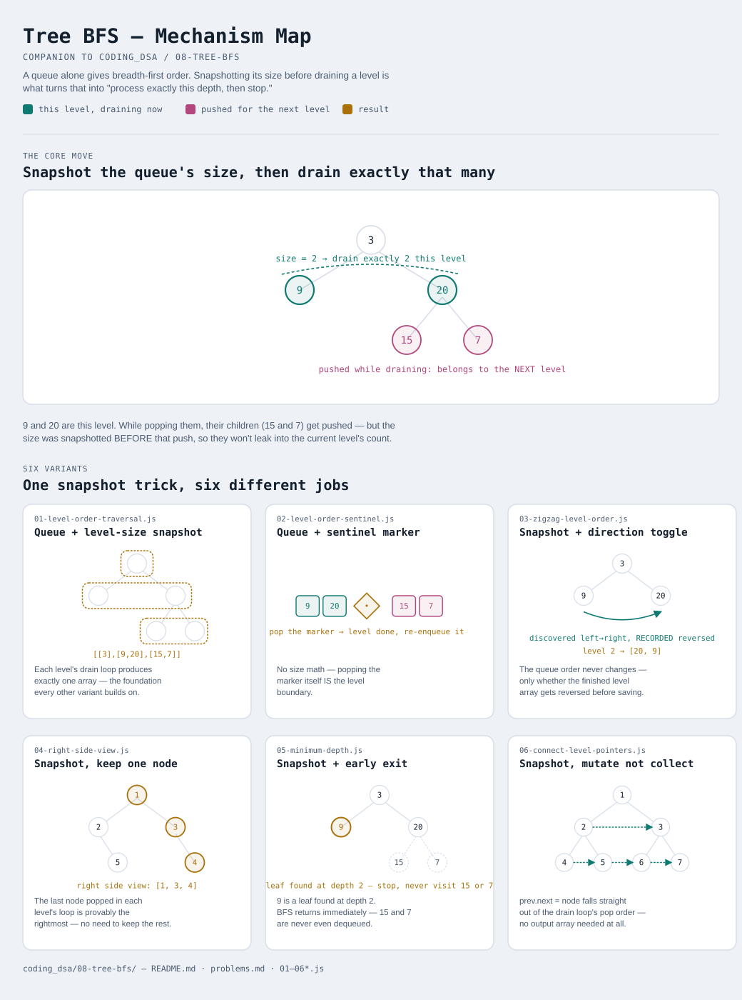

# Tree BFS

Interactive version: [diagram.html](diagram.html) (open in a browser)

## What
- Visit a tree **level by level** (breadth-first) instead of root-to-leaf
  (depth-first), using a queue
- A plain queue alone gives BFS order but not level BOUNDARIES — every
  variant here adds one extra trick to know exactly where one level ends and
  the next begins
- What you DO with each level — collect it, reverse it, take one node from
  it, link it, or stop at it — is what changes between variants

## When to use it
Applies when:
1. The question is naturally about **depth** or **breadth**: "level order",
   "shortest path in an unweighted tree", "what's visible from the side",
   "connect same-depth nodes"
2. You need the SHALLOWEST answer specifically — BFS finds it without
   visiting deeper nodes first, unlike DFS which has to explore fully and
   compare (see variant 5)
3. The structure is a **tree** (or another structure with an obvious "one
   step away" relation) — the grid/graph version of this same queue
   mechanism, with multiple starting points instead of one root, belongs to
   the future Graph BFS module, not here

## Why it works
- A queue naturally processes FIFO — first node discovered is the first one
  expanded — which is exactly what "breadth first" means
- Snapshotting `queue.length` before draining a level is what turns "a
  queue" into "a queue that knows level boundaries": everything enqueued
  during that drain belongs to the next level, guaranteed, because children
  are always deeper than their parents

## Six variants — the honest count
Same principle as recent modules: one queue mechanic, six different jobs.
No padding to hit a round number.

| File | Variant | Use when |
|---|---|---|
| [01-level-order-traversal.js](01-level-order-traversal.js) | Queue + level-size snapshot | the foundation: group nodes into arrays by depth |
| [02-level-order-sentinel.js](02-level-order-sentinel.js) | Queue + sentinel marker | same result, level boundary marked by a delimiter instead of a size count |
| [03-zigzag-level-order.js](03-zigzag-level-order.js) | Snapshot + direction toggle | levels alternate left-to-right / right-to-left |
| [04-right-side-view.js](04-right-side-view.js) | Snapshot, keep one node | only the rightmost (or leftmost) node per level matters |
| [05-minimum-depth.js](05-minimum-depth.js) | Snapshot + early exit | shortest root-to-leaf distance — stop at the FIRST leaf found |
| [06-connect-level-pointers.js](06-connect-level-pointers.js) | Snapshot, mutate not collect | link same-depth nodes to each other in place |

Each file is runnable standalone: `node 0X-name.js` prints a demo run.

See [problems.md](problems.md) for a suggested practice order.
