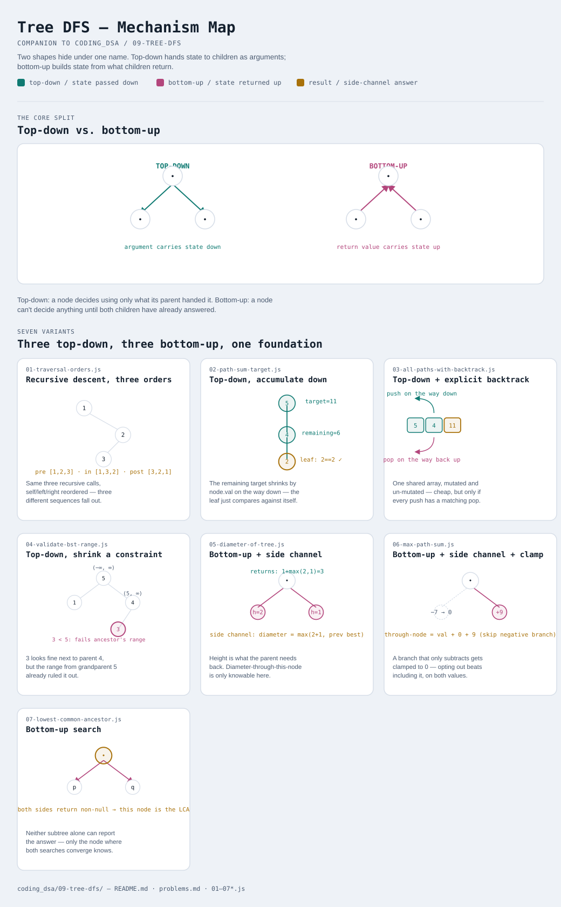

# Tree DFS

Interactive version: [diagram.html](diagram.html) (open in a browser)

## What
- Visit a tree depth-first — all the way down one branch before backing up
  to try another — using recursion (the call stack IS the "stack" in
  depth-first)
- Two fundamentally different data-flow shapes live under this one name:
  **top-down** (state computed before recursing, passed as arguments) and
  **bottom-up** (state computed by combining children's return values)
- Which shape a problem needs is the single most important design decision
  in this whole module — get it backwards and the code fights you

## When to use it
Applies when:
1. The question is about **paths** (root-to-leaf, node-to-node), or about a
   property that depends on **subtree structure** (height, balance, validity)
2. Ask: does answering this need to know something from ABOVE (the path so
   far, an accumulated sum, a valid range) — that's top-down — or does it
   need to know something from BELOW (my children's heights, whether they
   contain a target) — that's bottom-up. A few problems need both directions
   at once (variants 5 and 6)
3. Recursion depth is bounded by tree height, not node count — a very
   unbalanced tree (essentially a linked list) can still blow the call stack

## Why it works
- **Top-down**: information flows parent → child as arguments. Each call
  makes a LOCAL decision using only what it was handed — nothing needs to
  look back up afterward
- **Bottom-up**: information flows child → parent as return values. A node
  can't answer anything until both children have already answered
- Some problems (diameter, max path sum) need a value returned to the
  parent AND a completely different global answer updated as a side effect
  — the returned value is "what's useful to my caller", the side-channel is
  "what the problem actually asked for"

## Seven variants — more than usual, honestly
This pattern supports more genuinely distinct data-flow shapes than most
other modules in this repo — three top-down, two bottom-up-with-side-channel,
one pure bottom-up search, plus the traversal-order foundation. Seven is the
honest count, not six padded up or eight trimmed down.

| File | Variant | Use when |
|---|---|---|
| [01-traversal-orders.js](01-traversal-orders.js) | Recursive descent, three orders | need a specific linear order: preorder, inorder, postorder |
| [02-path-sum-target.js](02-path-sum-target.js) | Top-down, accumulate down | does any root-to-leaf path sum to a target — decide at the leaf |
| [03-all-paths-with-backtrack.js](03-all-paths-with-backtrack.js) | Top-down + explicit backtrack | need the actual paths, not just yes/no — mutate a shared path, then undo |
| [04-validate-bst-range.js](04-validate-bst-range.js) | Top-down, shrink a constraint | check every node against ALL ancestors at once, not just its parent |
| [05-diameter-of-tree.js](05-diameter-of-tree.js) | Bottom-up + side channel | return height to the parent; track the real answer separately |
| [06-max-path-sum.js](06-max-path-sum.js) | Bottom-up + side channel + clamping | same shape as variant 5, plus negative values that can be opted out of |
| [07-lowest-common-ancestor.js](07-lowest-common-ancestor.js) | Bottom-up search | the recursion returns a NODE — answer is where two searches converge |

Each file is runnable standalone: `node 0X-name.js` prints a demo run.

See [problems.md](problems.md) for a suggested practice order.
