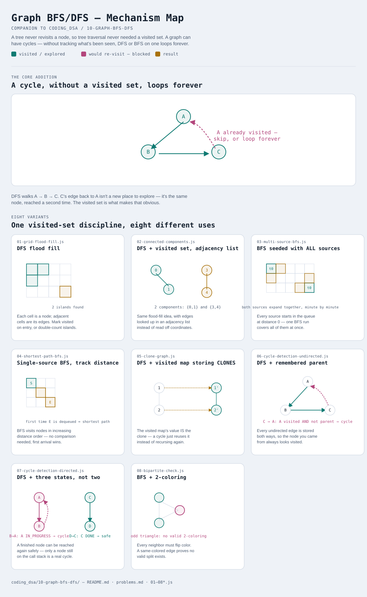

# Graph BFS/DFS

Interactive version: [diagram.html](diagram.html) (open in a browser)

## What
- Everything [08-tree-bfs](../08-tree-bfs/README.md) and [09-tree-dfs](../09-tree-dfs/README.md)
  do, generalized to structures that **aren't trees**: grids (implicit
  neighbor graphs) and graphs with cycles, multiple components, or
  direction
- A tree has no cycles and exactly one path between any two nodes, so it
  never needed a `visited` set. That single addition — and what else gets
  tracked alongside it — is what this whole module is about

## When to use it
Applies when:
1. The structure has **cycles**, or you can't rule them out — a plain
   recursive walk with no visited-tracking will loop forever
2. The structure has **multiple disconnected pieces** — the traversal needs
   an outer loop that restarts it from every not-yet-visited node
3. It's a **grid** — treat each cell as a node and its up/down/left/right
   (or 8-directional) neighbors as edges; every tree/graph technique here
   applies directly once that reframing clicks

## Why it works
- A `visited` marker (a Set, a grid overwrite, a color array) is what turns
  "walk the graph" into "walk the graph exactly once" — without it, BFS/DFS
  on anything with a cycle never terminates
- What gets stored alongside "visited" is where the variants differ: a
  boolean (has this been seen), a distance (how far away), a parent (where
  did I come from), a clone (what's the copy), or a color (which of two groups)

## Eight variants — the honest count
Cycle-handling adds a genuinely new axis beyond what the tree modules
needed, so this module supports more distinct mechanisms than most. Eight
reflects that, not a padded target.

| File | Variant | Use when |
|---|---|---|
| [01-grid-flood-fill.js](01-grid-flood-fill.js) | DFS flood fill | count connected regions in a grid — the foundation: a grid IS a graph |
| [02-connected-components.js](02-connected-components.js) | DFS + visited set, adjacency list | same idea, generalized to explicit edges instead of grid coordinates |
| [03-multi-source-bfs.js](03-multi-source-bfs.js) | BFS seeded with ALL sources at once | many starting points spread simultaneously — level = one unit of time |
| [04-shortest-path-bfs.js](04-shortest-path-bfs.js) | Single-source BFS, track distance | shortest path in an unweighted grid/graph — BFS finds it with no comparison needed |
| [05-clone-graph.js](05-clone-graph.js) | DFS + visited map storing CLONES | deep-copy a graph that may contain cycles |
| [06-cycle-detection-undirected.js](06-cycle-detection-undirected.js) | DFS + remembered parent | does an undirected graph contain a cycle |
| [07-cycle-detection-directed.js](07-cycle-detection-directed.js) | DFS + three states (not two) | does a directed graph contain a cycle — "visited" alone can't tell a back-edge from a cross-edge |
| [08-bipartite-check.js](08-bipartite-check.js) | BFS + 2-coloring | can the graph be split into two groups with no same-group edge |

Each file is runnable standalone: `node 0X-name.js` prints a demo run.

See [problems.md](problems.md) for a suggested practice order.
