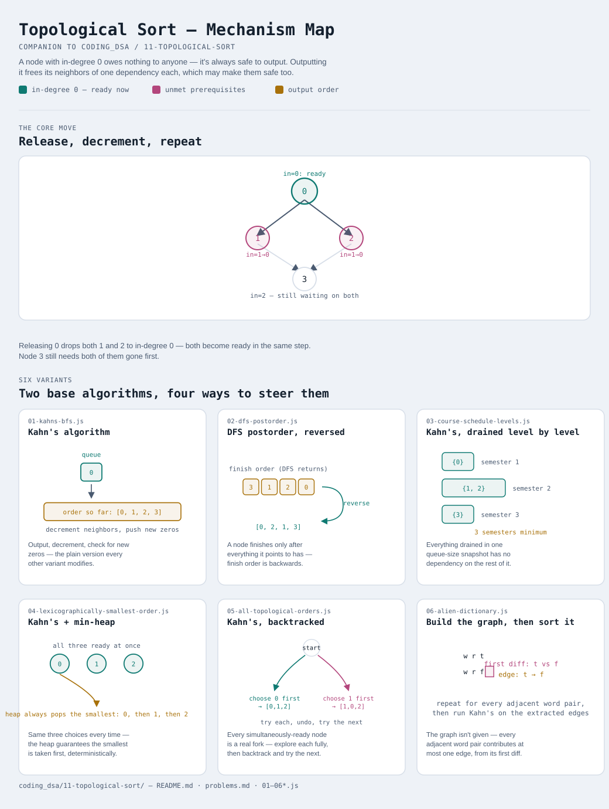

# Topological Sort

Interactive version: [diagram.html](diagram.html) (open in a browser)

## What
- Order the nodes of a **directed acyclic graph** so every edge `u -> v`
  places `u` before `v` — "do this before that", generalized across an
  entire dependency graph at once
- Two base algorithms produce a valid order (Kahn's BFS-by-in-degree, and
  DFS-postorder-reversed) — everything else in this module is one of those
  two, with the queue/stack swapped for something that changes WHICH valid
  order comes out, or applied to a graph that has to be built first

## When to use it
Applies when:
1. The relationship is "must happen before" — build order, course
   prerequisites, task scheduling, symbol/word ordering inferred from
   constraints
2. The graph is **directed**, and a valid order only exists if it's also
   **acyclic** — a cycle means two things each require the other to happen
   first, which is unsatisfiable
3. This is the direct successor to [10-graph-bfs-dfs](../10-graph-bfs-dfs/README.md)'s
   directed cycle detection (variant 7) — that check IS what determines
   whether a topological sort is even possible

## Why it works
- **Kahn's (BFS)**: a node with in-degree 0 has no unmet prerequisite — always
  safe to output. Outputting it and decrementing its neighbors' in-degree is
  what "removes" its edges, which may unlock new in-degree-0 nodes
- **DFS-postorder**: a node can only finish (be marked DONE) after
  everything it points to has already finished — so finish order has
  dependents before their dependencies, and reversing it fixes that
- Either way: if the algorithm can't account for every node, a cycle is
  blocking the rest — no valid order exists

## Six variants — the honest count
Two base algorithms, four ways of swapping a piece of one or applying it to
a harder input. Not padded to a round number.

| File | Variant | Use when |
|---|---|---|
| [01-kahns-bfs.js](01-kahns-bfs.js) | Kahn's algorithm | the standard case: BFS driven by in-degree instead of a visited set |
| [02-dfs-postorder.js](02-dfs-postorder.js) | DFS postorder, reversed | same result via DFS — reuses module 10's three-state cycle check |
| [03-course-schedule-levels.js](03-course-schedule-levels.js) | Kahn's, drained level by level | minimum rounds/semesters needed if independent tasks run in parallel |
| [04-lexicographically-smallest-order.js](04-lexicographically-smallest-order.js) | Kahn's + min-heap | among all valid orders, find the smallest one — the heap breaks ties by value |
| [05-all-topological-orders.js](05-all-topological-orders.js) | Kahn's, backtracked | enumerate every valid order, not just one |
| [06-alien-dictionary.js](06-alien-dictionary.js) | Build the graph, then sort it | the edges aren't given — they have to be extracted from word-order constraints first |

Each file is runnable standalone: `node 0X-name.js` prints a demo run.

See [problems.md](problems.md) for a suggested practice order.
