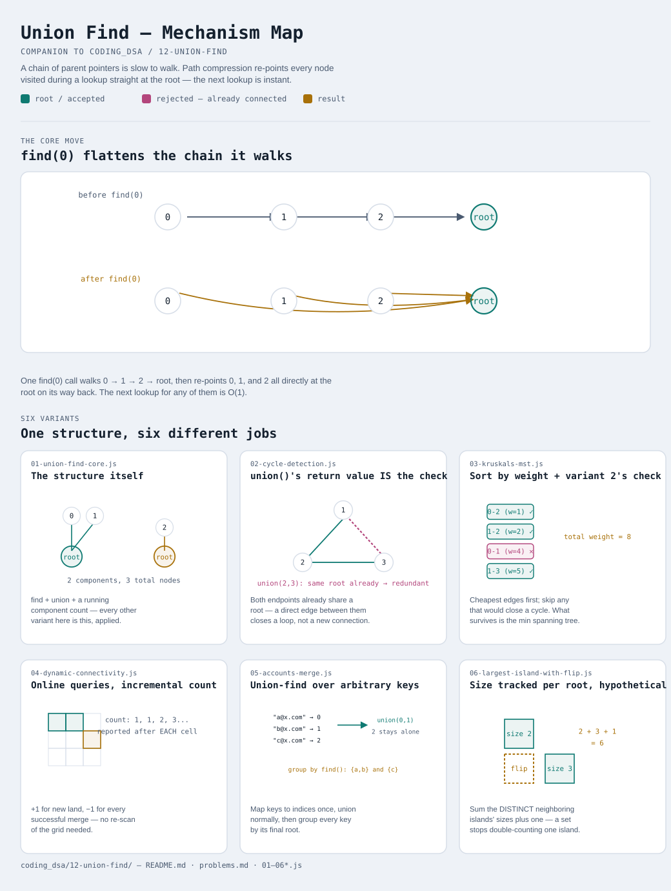

# Union Find (Disjoint Set)

Interactive version: [diagram.html](diagram.html) (open in a browser)

## What
- A forest of trees, one per group, where every node points toward a
  shared root — "same root" means "same group"
- Two operations, both fast: `find(x)` (which group is x in?) and
  `union(x, y)` (merge x's group and y's group)
- Answers "are these connected?" without re-running a traversal every time
  — the structure remembers what's already been discovered

## When to use it
Applies when:
1. The question is about **dynamic connectivity**: does adding this edge
   create a cycle, are these two things in the same group, how many groups
   are there — especially when edges/unions arrive one at a time
2. A DFS/BFS-based answer ([10-graph-bfs-dfs](../10-graph-bfs-dfs/README.md))
   would need to be recomputed from scratch after every change — union-find
   updates incrementally instead
3. You never need to SPLIT a group back apart — union-find only merges;
   there's no "undo" or "disconnect" operation in the classic version

## Why it works
- **Path compression**: every node visited during `find()` gets re-pointed
  straight at the root, flattening the tree as a side effect of normal use
- **Union by rank**: attaching the shorter tree under the taller one's root
  stops trees from growing tall in the first place
- Together, these two tricks give amortized **O(α(n))** per operation —
  α is the inverse Ackermann function, which is under 5 for any input size
  that could ever exist in practice, so this is "basically constant time"

## Six variants — the honest count
One data structure, six different jobs. Not padded to a round number.

| File | Variant | Use when |
|---|---|---|
| [01-union-find-core.js](01-union-find-core.js) | The structure itself | foundation: path compression + union by rank, `find`/`union`/component count |
| [02-cycle-detection.js](02-cycle-detection.js) | `union()`'s return value IS the check | find the one edge that creates a cycle, as edges arrive one at a time |
| [03-kruskals-mst.js](03-kruskals-mst.js) | Sort by weight + variant 2's check | minimum spanning tree — greedy edge selection, cycle-avoidance via union-find |
| [04-dynamic-connectivity.js](04-dynamic-connectivity.js) | Online queries, incremental count | report the connected-component count after EACH addition, not just once at the end |
| [05-accounts-merge.js](05-accounts-merge.js) | Union-find over arbitrary keys | the things being grouped aren't small integers — map them to indices first |
| [06-largest-island-with-flip.js](06-largest-island-with-flip.js) | Size tracked per root, then a hypothetical | "what if one more cell joined this group" — needs size, not just connectivity |

Each file is runnable standalone: `node 0X-name.js` prints a demo run.

See [problems.md](problems.md) for a suggested practice order.
