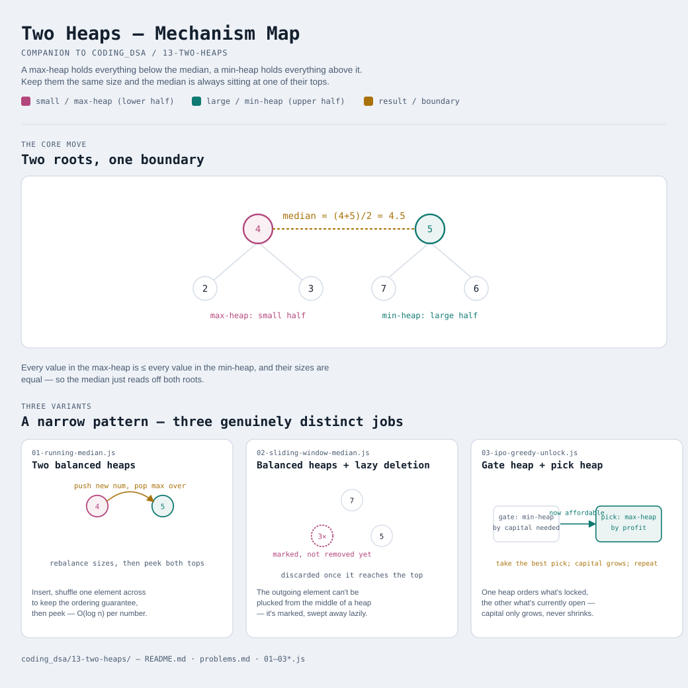

# Two Heaps

Interactive version: [diagram.html](diagram.html) (open in a browser)

## What
- Two heaps working together, split by role: a **max-heap** (largest on
  top) and a **min-heap** (smallest on top)
- Two different jobs show up under this name: keep them balanced so the
  boundary between them IS the answer (variants 1-2), or use one to gate
  what's allowed into the other (variant 3)
- Not about a single priority queue — it's about what happens at the
  boundary between two of them

## When to use it
Applies when:
1. You need the **median**, or some other order-statistic boundary, of data
   that keeps changing — not a one-time sort, an answer that has to update
   as elements come and go
2. Re-sorting on every update would be too slow (O(n log n) per insert);
   two heaps keep insert at O(log n) and the boundary readable in O(1)
3. Or: there's a **gating condition** (affordability, availability) that
   determines which of several options can currently be chosen at all —
   one heap orders the not-yet-available options, the other orders the
   available ones by which is best to take

## Why it works
- Balancing (variants 1-2): keeping every element in the "small" heap ≤
  every element in the "large" heap, and their sizes within 1 of each
  other, means the median is always sitting at a top — no scan required
- Gating (variant 3): an option that can't be afforded yet only becomes
  MORE affordable later, never less (capital only grows) — so greedily
  taking the best currently-available option, then re-checking what just
  unlocked, is provably optimal

## Three variants — a narrow pattern, honestly
This is one of the narrowest patterns in this repo, on par with
[03-fast-slow-pointers](../03-fast-slow-pointers/README.md). Three is the
genuine count of distinct two-heap mechanisms, not a trimmed-down list.

| File | Variant | Use when |
|---|---|---|
| [01-running-median.js](01-running-median.js) | Two balanced heaps | median of an ever-growing stream, after every insertion |
| [02-sliding-window-median.js](02-sliding-window-median.js) | Balanced heaps + lazy deletion | same median tracking, but over a fixed-size sliding window |
| [03-ipo-greedy-unlock.js](03-ipo-greedy-unlock.js) | Gate heap + pick heap | choose the best of only-currently-available options, where availability changes as you choose |

Each file is runnable standalone: `node 0X-name.js` prints a demo run.

See [problems.md](problems.md) for a suggested practice order.
