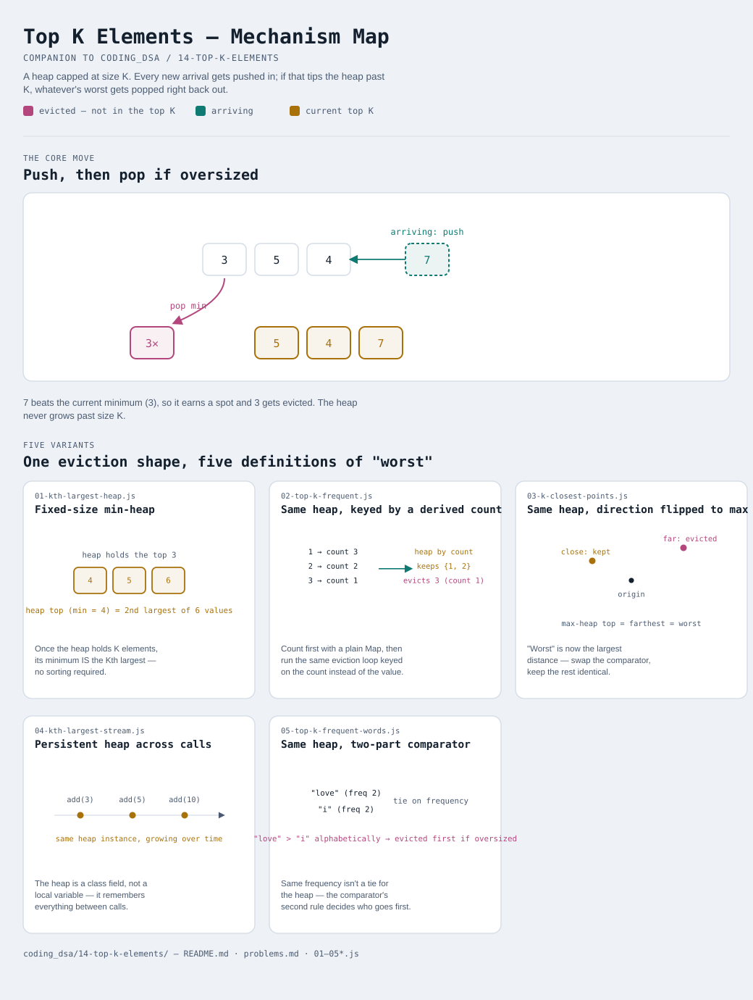

# Top K Elements

Interactive version: [diagram.html](diagram.html) (open in a browser)

## What
- A single heap, capped at size **K** — once it holds K elements, adding a
  new one means evicting the current worst
- What "worst" means changes per problem (smallest value, lowest frequency,
  farthest point), but the eviction shape stays identical: push, then pop
  if oversized
- Different from [13-two-heaps](../13-two-heaps/README.md): that pattern
  splits data across two heaps at a shared boundary; this one keeps ONE
  heap, bounded by a fixed count

## When to use it
Applies when:
1. The question is "the K best/worst/most-X", not a full sort — sorting
   everything is O(n log n); a size-K heap is O(n log k), which matters
   when K is much smaller than n
2. The heap only ever needs to answer "what belongs in the top K", not
   "what's the exact rank of every element" — a size-K heap doesn't know or
   care about ordering *within* the top K until you read it out at the end
3. Data may arrive continuously (variant 4) — a persistent size-K heap
   updates in O(log k) per new item, far cheaper than re-sorting on every arrival

## Why it works
- A min-heap capped at size K, used for "K largest": once full, its top is
  the SMALLEST of the current top-K candidates — exactly the threshold a
  new value must beat to earn a spot
- Anything popped is provably not in the true top K: at the moment it's
  evicted, K other elements already documented as being >= it are sitting
  in the heap
- The heap's ORDER direction (min vs max) flips depending on whether
  "worst" means smallest or largest — the surrounding algorithm doesn't change

## Five variants — the honest count
One eviction shape, five different definitions of "worst". Not padded to a
round number.

| File | Variant | Use when |
|---|---|---|
| [01-kth-largest-heap.js](01-kth-largest-heap.js) | Fixed-size min-heap | Kth largest element — the foundation (compare to quickselect in [02-two-pointers/11-pivot-partition.js](../02-two-pointers/11-pivot-partition.js)) |
| [02-top-k-frequent.js](02-top-k-frequent.js) | Same heap, keyed by a derived count | K most frequent elements — count first, then heap by count |
| [03-k-closest-points.js](03-k-closest-points.js) | Same heap, direction flipped to max | K closest points — "worst" is farthest, so a max-heap evicts it |
| [04-kth-largest-stream.js](04-kth-largest-stream.js) | Persistent heap across calls | Kth largest in an ongoing stream — state survives between `add()` calls |
| [05-top-k-frequent-words.js](05-top-k-frequent-words.js) | Same heap, two-part comparator | ties need a second rule (frequency, then alphabetical) or the result is ambiguous |

Each file is runnable standalone: `node 0X-name.js` prints a demo run.

See [problems.md](problems.md) for a suggested practice order.
