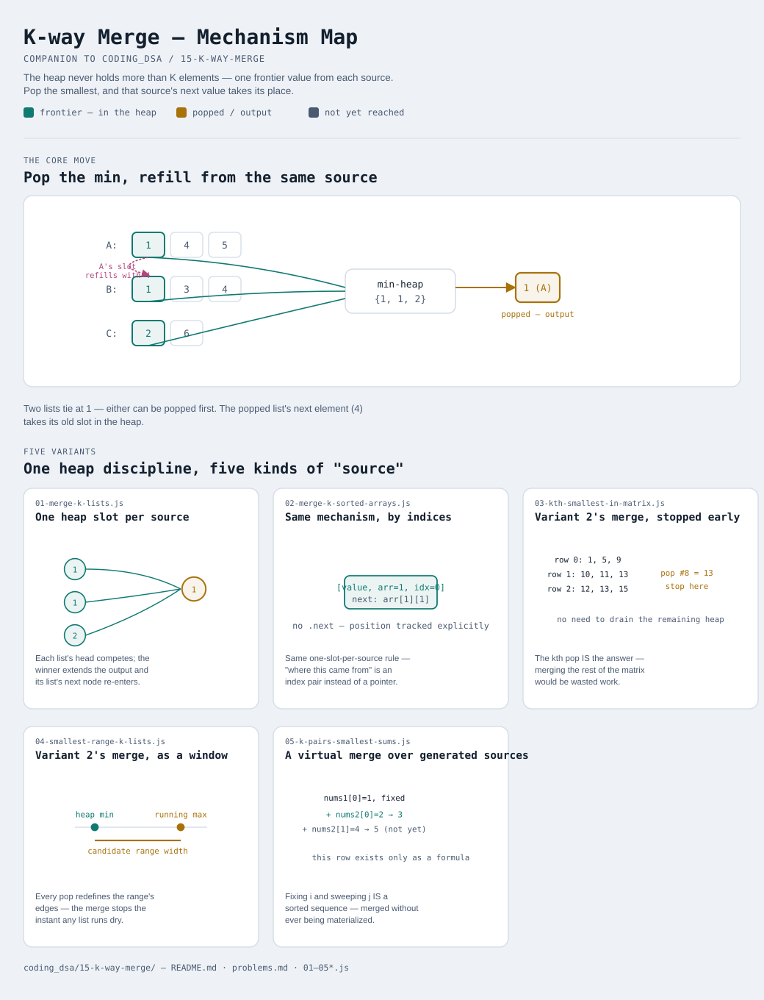

# K-way Merge

Interactive version: [diagram.html](diagram.html) (open in a browser)

## What
- A min-heap holding exactly **one candidate per source** — K sorted
  lists, arrays, matrix rows, or even implicit combination sequences —
  never more than K elements at a time
- Popping the overall smallest and pushing that same source's next
  candidate keeps every source represented until it runs out
- Different from [14-top-k-elements](../14-top-k-elements/README.md):
  that pattern's heap tracks the K *best* elements seen; this one's heap
  tracks one *frontier* element from each of K *sources*

## When to use it
Applies when:
1. There are K already-sorted sequences that need combining, or
   comparing, into one answer — merged output, a specific rank (Kth
   smallest), or a range that touches all of them
2. Merging pairwise (K-1 rounds of merging two lists at a time) would
   re-scan already-merged output repeatedly — a heap instead finds the
   global minimum across all K sources directly, every time
3. The "K sequences" aren't literally given as K arrays — they can be
   rows of a matrix, or even generated lazily from a combination space
   (variant 5)

## Why it works
- The heap holding one slot per source means the true global minimum
  across everything not yet emitted is always sitting at the top —
  comparing across all K sources costs O(log K), not O(K)
- Total work across a full merge of n elements is O(n log K): each
  element is pushed once and popped once, and K stays small even when n
  (the total element count) is large

## Five variants
Five ways of reading the same "one slot per source" heap discipline — full
merge, early-stopped merge, a tracked window, and a merge over sources
that don't literally exist as arrays.

| File | Variant | Use when |
|---|---|---|
| [01-merge-k-lists.js](01-merge-k-lists.js) | One heap slot per source, linked lists | the foundation: merge K sorted linked lists into one |
| [02-merge-k-sorted-arrays.js](02-merge-k-sorted-arrays.js) | Same mechanism, tracked by indices | merge K sorted arrays — no `.next`, so track (array, position) instead |
| [03-kth-smallest-in-matrix.js](03-kth-smallest-in-matrix.js) | Variant 2's merge, stopped early | Kth smallest in a row/column-sorted matrix — stop at the kth pop |
| [04-smallest-range-k-lists.js](04-smallest-range-k-lists.js) | Variant 2's merge, read as a window | smallest range covering at least one element from every list |
| [05-k-pairs-smallest-sums.js](05-k-pairs-smallest-sums.js) | A virtual merge over generated sources | K smallest pair-sums — sources are computed lazily, not stored |

Each file is runnable standalone: `node 0X-name.js` prints a demo run.

See [problems.md](problems.md) for a suggested practice order.
