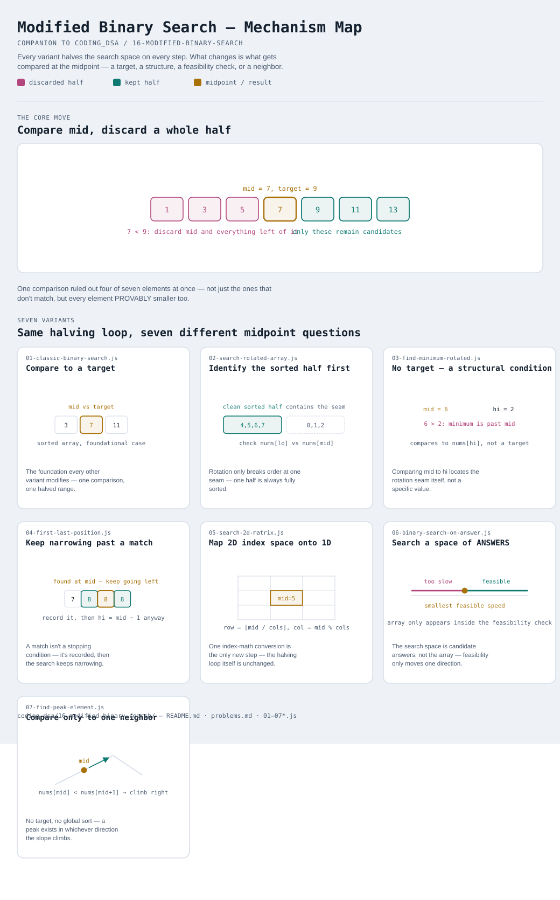

# Modified Binary Search

Interactive version: [diagram.html](diagram.html) (open in a browser)

## What
- Cut the search space in half on every step — the one thing every variant
  here shares
- What differs is WHAT gets compared to decide which half to keep: a
  target value, a structural fact about rotation, a boundary condition, a
  feasibility check over a space of answers, or just one neighbor
- Doesn't require a literally sorted array — only a search space where one
  comparison can always rule out half the remaining candidates

## When to use it
Applies when:
1. The brute-force answer is an O(n) linear scan, and there's SOME
   monotonic property that lets a single comparison discard half the
   remaining candidates
2. The array being searched has a broken/partial order (rotated, or not
   sorted at all) but still has enough local structure to make a halving
   decision at each step
3. The thing being searched isn't an array index at all — it's a range of
   POSSIBLE ANSWERS (variant 6), where testing one candidate is cheap and
   feasibility only moves in one direction

## Why it works
- Every variant reduces to the same shape: pick a midpoint, ask ONE
  question about it, throw away the half that the answer can't be in
- O(log n) instead of O(n) — each step doesn't just eliminate one
  candidate, it eliminates HALF the remaining ones, so it takes only
  log2(n) steps to get down to a single candidate

## Seven variants
Seven genuinely different "what gets compared" answers, from the
foundational case through the least obvious (answer-space search,
neighbor-only comparison).

| File | Variant | Use when |
|---|---|---|
| [01-classic-binary-search.js](01-classic-binary-search.js) | Compare to a target | the foundation: find an exact value in a sorted array |
| [02-search-rotated-array.js](02-search-rotated-array.js) | Identify the sorted half, then search it | array was rotated at an unknown pivot |
| [03-find-minimum-rotated.js](03-find-minimum-rotated.js) | No target — a structural condition | find the rotation point itself |
| [04-first-last-position.js](04-first-last-position.js) | Keep narrowing past a match | find the first/last index of a repeated target |
| [05-search-2d-matrix.js](05-search-2d-matrix.js) | Map 2D index space onto 1D | a fully-sorted matrix, searched as one flat sequence |
| [06-binary-search-on-answer.js](06-binary-search-on-answer.js) | Search a space of ANSWERS, not the array | "minimum X such that a feasibility check passes" |
| [07-find-peak-element.js](07-find-peak-element.js) | Compare only to one neighbor | no target, no global order — just climb toward a peak |

Each file is runnable standalone: `node 0X-name.js` prints a demo run.

See [problems.md](problems.md) for a suggested practice order.
