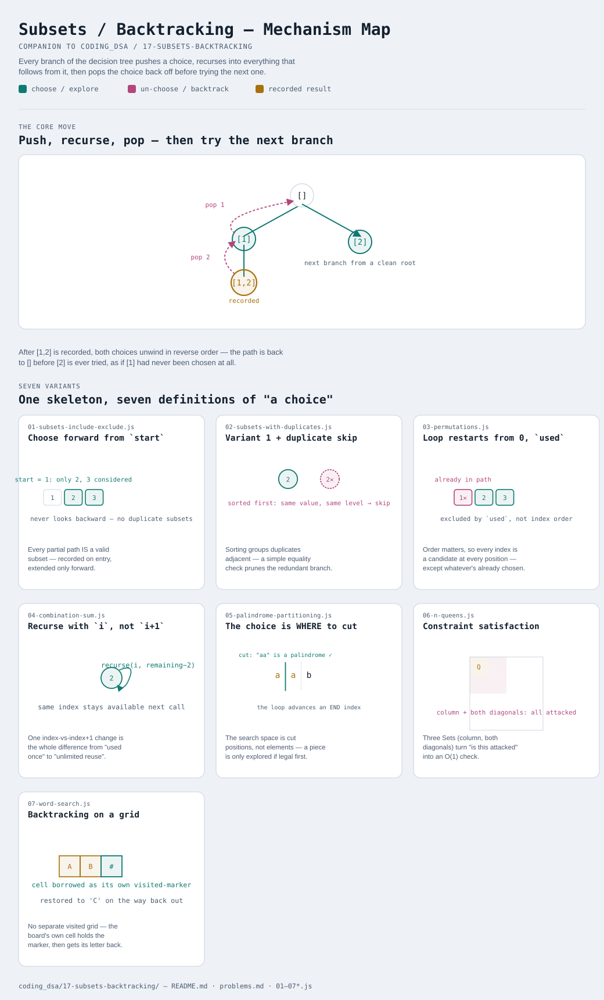

# Subsets / Backtracking

Interactive version: [diagram.html](diagram.html) (open in a browser)

## What
- One shape, everywhere: **choose** something, **explore** what follows
  from that choice, **un-choose** it before trying the next option
- The un-choose step is what makes this cheap — one shared, mutated
  path/board/tracking-set instead of copying state at every branch
- What changes between variants is what counts as a "choice": an element
  to include, a position to place something, a cut point, a neighboring cell

## When to use it
Applies when:
1. The question asks for ALL valid outcomes (every subset, every
   arrangement, every solution), or asks whether at least one exists,
   where the only way to know is to actually try combinations
2. Invalid partial states can be recognized EARLY, before finishing the
   whole thing — a queen check, a palindrome check, a sum exceeding target
   — so failing paths get abandoned before wasting time exploring further
3. The choices form a tree of decisions where undoing one choice cleanly
   returns to a state identical to before it was made

## Why it works
- Recursion's call stack IS the "undo history" — when a call returns,
   everything it did to shared state gets undone by the code right after
   the recursive call, in the reverse order it was applied
- Pruning (skip a choice before recursing into it) is what keeps
  backtracking from being just "try everything" — a bad choice recognized
  immediately means its entire subtree of consequences is never even visited

## Seven variants
Seven applications of the exact same choose/explore/un-choose skeleton —
what's chosen, and what makes a choice illegal, is what actually differs.

| File | Variant | Use when |
|---|---|---|
| [01-subsets-include-exclude.js](01-subsets-include-exclude.js) | Choose forward from `start` | the foundation: every subset of a set (LeetCode 78) |
| [02-subsets-with-duplicates.js](02-subsets-with-duplicates.js) | Variant 1 + same-level duplicate skip | the input has duplicate values — skip re-trying an identical choice at the same branch |
| [03-permutations.js](03-permutations.js) | Loop restarts from 0, tracked by `used` | ORDER matters — every arrangement, not just every subset |
| [04-combination-sum.js](04-combination-sum.js) | Recurse with `i`, not `i+1` | an element can be chosen again — unlimited reuse |
| [05-palindrome-partitioning.js](05-palindrome-partitioning.js) | The choice is WHERE to cut | partition into pieces, not select from a fixed set |
| [06-n-queens.js](06-n-queens.js) | Constraint satisfaction | every choice must survive a legality check against all prior choices |
| [07-word-search.js](07-word-search.js) | Backtracking on a grid | the board itself is mutated as the visited-marker, then restored |

Each file is runnable standalone: `node 0X-name.js` prints a demo run.

See [problems.md](problems.md) for a suggested practice order.
