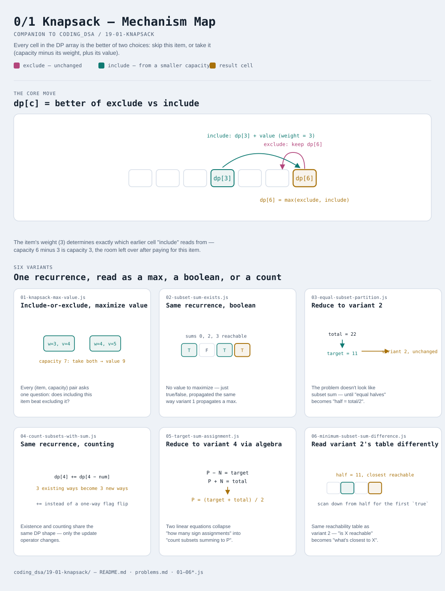

# 0/1 Knapsack

Interactive version: [diagram.html](diagram.html) (open in a browser)

## What
- Every item is either **in** the bag or **out** — no fractions, no
  repeats. That one branching decision, applied to every item against
  every possible remaining capacity, is the entire pattern
- What differs between variants is what the DP array HOLDS at each
  capacity: a maximum value, a yes/no reachability flag, or a count of
  ways — and what question gets asked of the finished table
- Several classic problems that don't look like knapsack at all (equal
  partition, target sum) turn out to BE knapsack once reframed — spotting
  that reframing is half the skill this module teaches

## When to use it
Applies when:
1. There's a set of items, each usable **at most once**, and a capacity
   constraint (weight, sum, count) that limits which combinations are valid
2. The brute-force answer tries all 2^n subsets — DP collapses that down
   to (items × capacity) states, because many different subsets share the
   same "remaining capacity" and don't need to be distinguished further
3. A problem statement mentions splitting into two groups, hitting an
   exact sum, or counting ways to reach a sum — these often reduce to
   subset sum (variant 2) after a small algebraic rewrite

## Why it works
- `dp[c]` after processing item i represents the best achievable outcome
  using capacity `c` and only the items seen so far — it never needs to
  remember WHICH items, only what they add up to
- Looping capacity **downward** (high to low) when using a 1D array is
  what keeps each item usable only once — looping upward would let
  `dp[c - weight]` already reflect this same item having been added,
  effectively reusing it

## Six variants
One recurrence — include or exclude — read six different ways: as a
maximum, a boolean, a count, and reached through two problems that only
resemble knapsack after a reduction.

| File | Variant | Use when |
|---|---|---|
| [01-knapsack-max-value.js](01-knapsack-max-value.js) | Include-or-exclude, maximize value | the foundation: weight/value items, maximize value under a capacity |
| [02-subset-sum-exists.js](02-subset-sum-exists.js) | Same recurrence, boolean reachability | does any subset sum to an exact target |
| [03-equal-subset-partition.js](03-equal-subset-partition.js) | Reduce to variant 2 | can the array split into two equal-sum halves |
| [04-count-subsets-with-sum.js](04-count-subsets-with-sum.js) | Same recurrence, counting | how many subsets sum to an exact target |
| [05-target-sum-assignment.js](05-target-sum-assignment.js) | Reduce to variant 4 via algebra | assign +/- signs to hit a target — turns into subset-sum counting |
| [06-minimum-subset-sum-difference.js](06-minimum-subset-sum-difference.js) | Read variant 2's table differently | minimize the difference between two split sums, not just check equality |

Each file is runnable standalone: `node 0X-name.js` prints a demo run.

See [problems.md](problems.md) for a suggested practice order.
