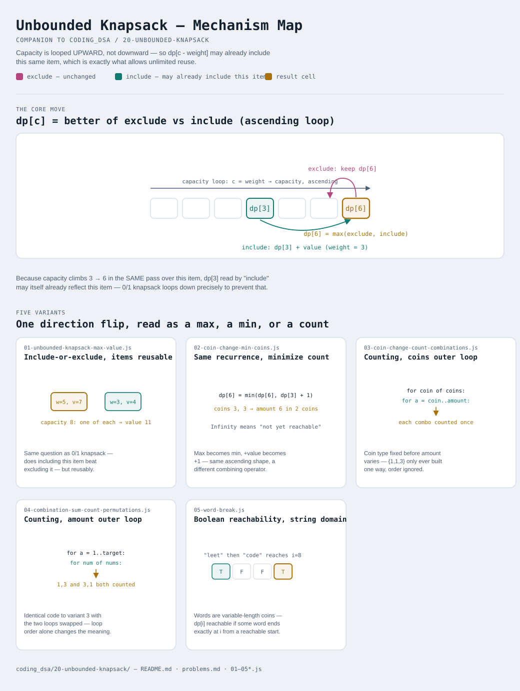

# Unbounded Knapsack

Interactive version: [diagram.html](diagram.html) (open in a browser)

## What
- The same include-or-exclude choice as [0/1 Knapsack](../19-01-knapsack/README.md)
  — except an item can be included **any number of times**, not just once
- The entire mechanical difference from 0/1 knapsack is one loop direction:
  capacity is looped **upward** instead of downward, so `dp[c - weight]`
  is allowed to already reflect this same item having been used earlier
  in the same pass
- What differs between variants is again what the DP array HOLDS — a max
  value, a min count, or a count of ways — plus, for counting variants,
  whether the two loops are ordered coins-outer (combinations) or
  amount-outer (permutations)

## When to use it
Applies when:
1. There's a supply of item types, each usable an **unlimited** number of
   times, and a capacity/target that limits which combinations are valid
   — coin systems, rod cutting, tiling, and reusable dictionary words all
   fit this shape
2. The problem explicitly says "unlimited supply" or the same value can be
   picked repeatedly (as opposed to 0/1 knapsack's "each item once")
3. A string-segmentation problem allows the same substring/word to appear
   more than once — that's unbounded knapsack wearing a string costume
   (see variant 5)

## Why it works
- `dp[c]` after processing item i represents the best achievable outcome
  using capacity c and item i available for **unlimited reuse** —
  looping capacity upward means `dp[c - weight]` may itself already
  include item i, so the recurrence naturally re-selects it
- This is the single change from 0/1 knapsack's downward loop: 0/1 must
  loop down so `dp[c - weight]` is still "before this item"; unbounded
  loops up so it can be "during or after this item"
- For counting problems, loop **order** (not direction) decides whether
  arrangements are counted as combinations or permutations — outer loop
  over the item type collapses reorderings into one count; outer loop
  over the target counts every ordering separately

## Five variants
One direction flip on the 0/1 knapsack recurrence, read as a max, a min,
or a count — plus one loop-order flip that changes what "count" even means.

| File | Variant | Use when |
|---|---|---|
| [01-unbounded-knapsack-max-value.js](01-unbounded-knapsack-max-value.js) | Include-or-exclude, maximize value, items reusable | the foundation: weight/value items with unlimited supply, maximize value |
| [02-coin-change-min-coins.js](02-coin-change-min-coins.js) | Same recurrence, minimize count | fewest coins that sum to an exact amount |
| [03-coin-change-count-combinations.js](03-coin-change-count-combinations.js) | Same recurrence, counting, coins-outer loop | how many combinations of coins sum to an amount (order doesn't matter) |
| [04-combination-sum-count-permutations.js](04-combination-sum-count-permutations.js) | Same recurrence, counting, amount-outer loop | how many ordered sequences of numbers sum to a target (order matters) |
| [05-word-break.js](05-word-break.js) | Same recurrence, boolean reachability, string domain | can a string be split into dictionary words, each word reusable |

Each file is runnable standalone: `node 0X-name.js` prints a demo run.

See [problems.md](problems.md) for a suggested practice order.
