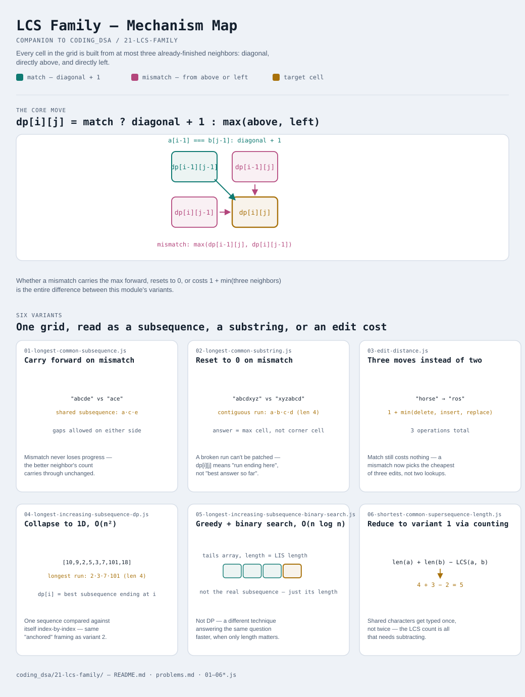

# LCS Family

Interactive version: [diagram.html](diagram.html) (open in a browser)

## What
- A 2D grid where `dp[i][j]` answers a question about the first i
  characters of one sequence and the first j characters of another —
  every cell is built from at most three neighbors: diagonal, above, left
- Matches move diagonally; the difference between variants is what
  happens on a MISMATCH — carry the best answer forward (subsequence,
  gaps allowed), reset to zero (substring, must stay contiguous), or pay
  a cost and try three moves instead of two (edit distance)
- Two variants (LIS) reduce the grid to 1D — one sequence compared
  against itself index-by-index — and one variant skips DP entirely for
  a faster greedy + binary search technique answering the same question

## When to use it
Applies when:
1. There are two sequences and the question is about how much they share
   — as a subsequence, a substring, or an edit distance
2. There's one sequence and the question is about an increasing (or
   otherwise ordered) run within it — LIS reframes "compare against
   another string" as "compare against yourself, only look backward"
3. The problem only asks for a LENGTH or COUNT, not the actual shared
   sequence itself — variant 6 shows a length can sometimes be derived
   from LCS without rebuilding a second grid

## Why it works
- `dp[i][j]` never needs to know WHICH earlier characters were used,
  only how many — the same "state, not path" idea every DP pattern in
  this repo relies on
- Building the grid left-to-right, top-to-bottom guarantees `dp[i-1][j-1]`,
  `dp[i-1][j]`, and `dp[i][j-1]` are already final by the time `dp[i][j]`
  needs them — no cell ever depends on one computed after it
- For the 1D variants (LIS), the same guarantee holds in one dimension:
  `dp[i]` only depends on `dp[j]` for `j < i`, so a single left-to-right
  pass suffices

## Six variants
One grid shape, read as a subsequence, a substring, an edit cost, or
collapsed to a single sequence — plus one deliberately non-DP technique
answering the same question faster.

| File | Variant | Use when |
|---|---|---|
| [01-longest-common-subsequence.js](01-longest-common-subsequence.js) | Carry forward on mismatch | longest shared subsequence between two strings, gaps allowed |
| [02-longest-common-substring.js](02-longest-common-substring.js) | Reset to 0 on mismatch | longest shared run that must stay contiguous |
| [03-edit-distance.js](03-edit-distance.js) | Three moves instead of two | minimum insert/delete/replace operations to transform one string into another |
| [04-longest-increasing-subsequence-dp.js](04-longest-increasing-subsequence-dp.js) | Collapse to 1D, O(n²) | longest strictly increasing run within a single array |
| [05-longest-increasing-subsequence-binary-search.js](05-longest-increasing-subsequence-binary-search.js) | Same question, greedy + binary search, O(n log n) | same as variant 4, but n is large and only the length is needed |
| [06-shortest-common-supersequence-length.js](06-shortest-common-supersequence-length.js) | Reduce to variant 1 via counting | shortest string containing both inputs as subsequences — length only |

Each file is runnable standalone: `node 0X-name.js` prints a demo run.

See [problems.md](problems.md) for a suggested practice order.
