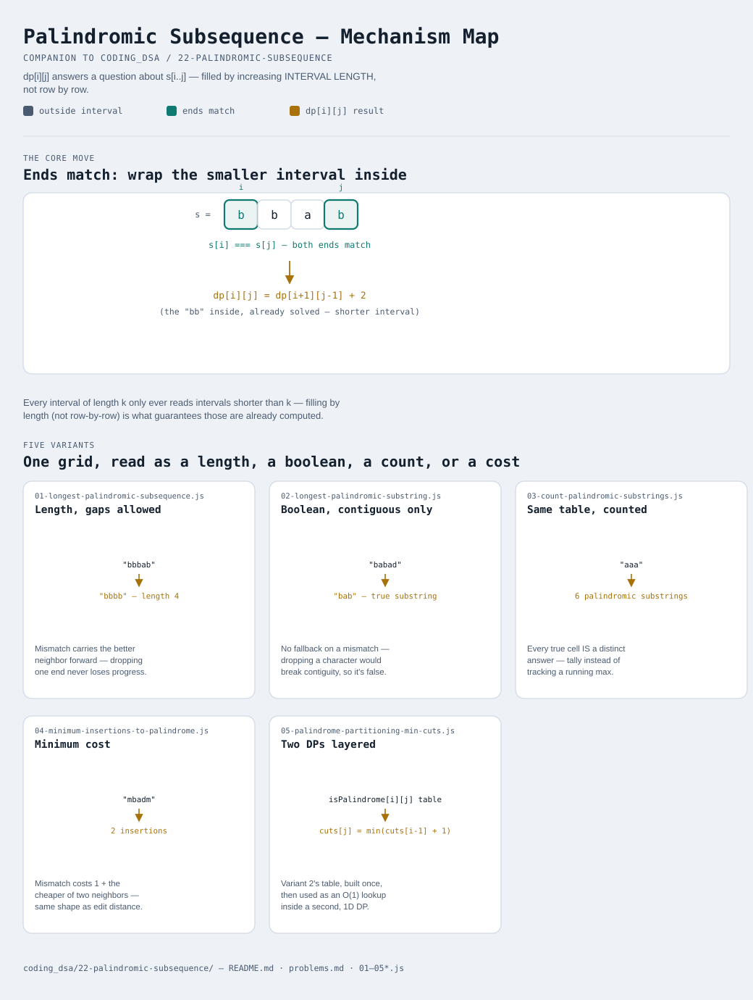

# Palindromic Subsequence

Interactive version: [diagram.html](diagram.html) (open in a browser)

## What
- Interval DP: `dp[i][j]` answers a question about the substring
  `s[i..j]` — one sequence, indexed by a pair of BOUNDARIES within it,
  not two sequences like [21-lcs-family](../21-lcs-family/README.md)
- The grid is filled by increasing INTERVAL LENGTH, not row-by-row —
  every cell only ever depends on strictly shorter intervals, so length
  order guarantees those are already computed
- What differs between variants is whether the ends matching lets you
  carry a value forward (subsequence, gaps allowed) or forces contiguity
  (substring) — the exact same subsequence-vs-substring split that
  shows up in the LCS family, just over one string instead of two

## When to use it
Applies when:
1. The question is about the substring/subarray between two indices
   `i` and `j` within a SINGLE sequence
2. A palindrome property specifically — matching from both ends inward
   is what makes the "ends agree, recurse on the middle" recurrence work
3. A problem needs the answer for every interval, not just the whole
   string — building the full table bottom-up (by length) answers all
   of them in one pass, useful when a SECOND DP (variant 5) needs to
   query arbitrary intervals cheaply afterward

## Why it works
- If both ends of an interval match, they can both belong to the
  answer, wrapping whatever was already found for the strictly smaller
  interval inside them
- If they don't match, the answer has to come from dropping one end or
  the other — never both at once, since that would skip past a
  potentially better answer
- Filling by length (not by row/column, unlike the two-sequence grid in
  LCS family) is what guarantees every dependency is already resolved:
  an interval of length `k` only ever depends on intervals shorter
  than `k`

## Five variants
One interval-DP grid, read as a length, a boolean, a count, a cost, or
composed into a second DP layer.

| File | Variant | Use when |
|---|---|---|
| [01-longest-palindromic-subsequence.js](01-longest-palindromic-subsequence.js) | Length, gaps allowed | the longest palindrome doesn't need to be contiguous |
| [02-longest-palindromic-substring.js](02-longest-palindromic-substring.js) | Boolean, contiguous only | the palindrome must be a true substring, no skipping characters |
| [03-count-palindromic-substrings.js](03-count-palindromic-substrings.js) | Same boolean table, counted | every palindromic substring needs counting, not just the longest |
| [04-minimum-insertions-to-palindrome.js](04-minimum-insertions-to-palindrome.js) | Minimum cost | turning a string into a palindrome with the fewest insertions |
| [05-palindrome-partitioning-min-cuts.js](05-palindrome-partitioning-min-cuts.js) | Two DPs layered | splitting a string into the fewest palindromic pieces |

Each file is runnable standalone: `node 0X-name.js` prints a demo run.

See [problems.md](problems.md) for a suggested practice order.
