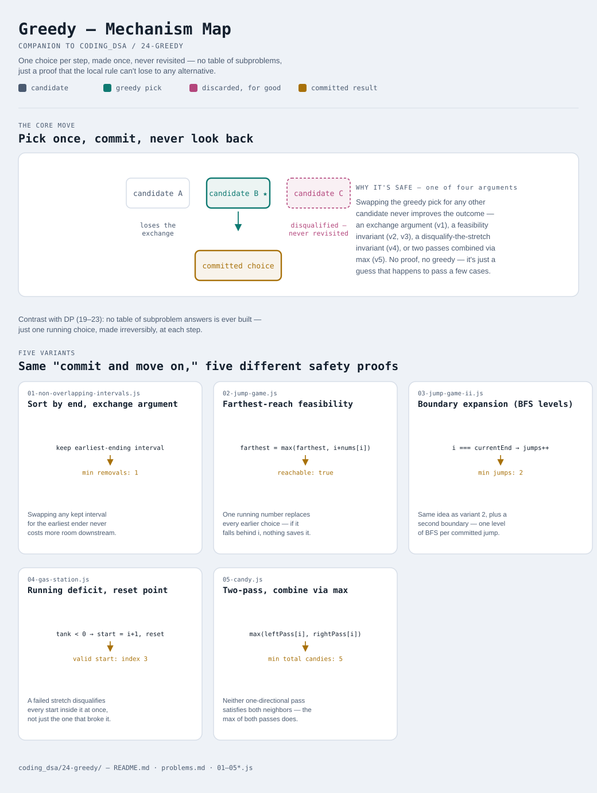

# Greedy

Interactive version: [diagram.html](diagram.html) (open in a browser)

## What
- Make one locally-optimal choice at each step and never revisit it — no
  backtracking, no trying alternatives
- Unlike every DP pattern in this repo (19 through 23), there's no table of
  subproblem answers being built up — just a single running choice
- The hard part isn't writing the loop, it's proving the local rule is
  actually safe: greedy is only correct when the problem has both an
  *optimal substructure* (an optimal solution contains optimal solutions to
  subproblems) and a *greedy-choice property* (a locally best choice is
  always part of some globally optimal solution)

## When to use it
Applies when:
1. You can define a simple local rule ("pick the interval that ends
   soonest", "always take the farthest reach so far") that never needs to
   be undone
2. You can articulate *why* the rule is safe — usually via an exchange
   argument (swapping the greedy choice for any other choice never makes
   the answer worse) or a feasibility invariant (if a solution exists at
   all, the greedy rule finds one)
3. If you can't state that argument, the problem probably needs DP instead
   — greedy without a correctness proof is just a guess that happens to
   pass a few test cases

## Why it works
Each variant below is "greedy" but the *reason* it's safe is different —
that's the actual thing to learn here, not the code:
- **Exchange argument** (variant 1): swapping any kept interval for the
  earliest-ending candidate never loses solutions and never gains
  conflicts, so sorting by end time and always taking the earliest ender
  is provably as good as any other choice
- **Feasibility invariant** (variants 2, 3): a single running number
  (farthest reachable index) summarizes every choice that came before it —
  no earlier decision needs to be remembered individually
- **Disqualify-the-whole-stretch invariant** (variant 4): if the running
  total goes negative starting from some index, every index inside that
  failed stretch is disqualified too, not just the one that broke it
- **Two passes, combine via max** (variant 5): when a single rule can't
  satisfy constraints from both directions at once, run it once per
  direction and combine — neither pass alone is correct, but the
  combination is

## Five variants

| File | Variant | Use when |
|---|---|---|
| [01-non-overlapping-intervals.js](01-non-overlapping-intervals.js) | Sort by end, exchange argument | picking/removing intervals to optimize a count |
| [02-jump-game.js](02-jump-game.js) | Farthest-reach feasibility | deciding if a goal is reachable at all |
| [03-jump-game-ii.js](03-jump-game-ii.js) | Boundary-expansion (implicit BFS levels) | minimizing the number of steps to reach a goal |
| [04-gas-station.js](04-gas-station.js) | Running deficit with reset | finding a valid circular starting point |
| [05-candy.js](05-candy.js) | Two-pass, combine via max | a local rule must hold against both neighbors at once |

Each file is runnable standalone: `node 0X-name.js` prints a demo run.

See [problems.md](problems.md) for a suggested practice order.
