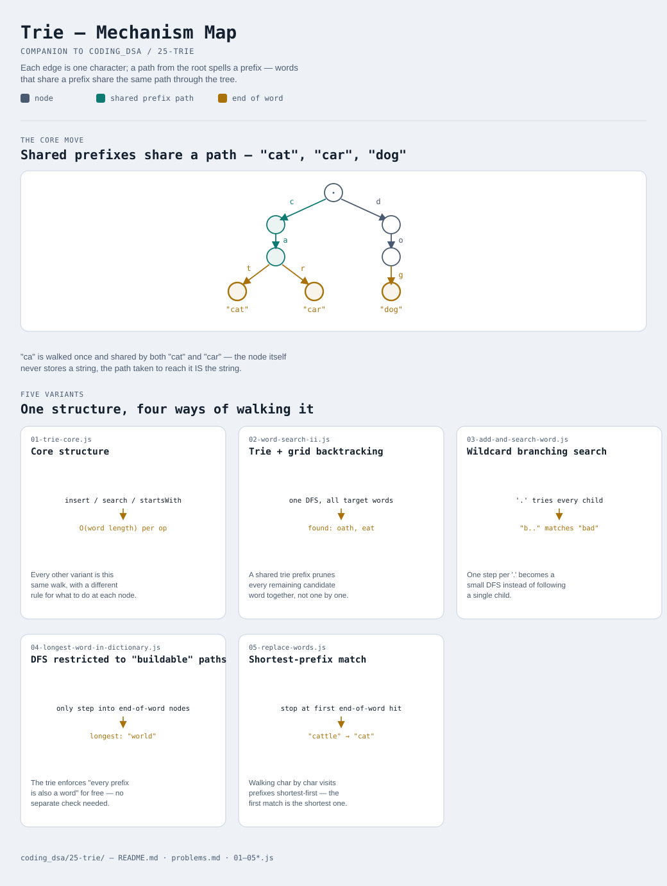

# Trie

Interactive version: [diagram.html](diagram.html) (open in a browser)

## What
- A tree where each edge is one character and each path from the root
  spells out a prefix — strings that share a prefix share the same path
- Nodes don't store the string they represent; the string IS the path
  taken to reach the node. A boolean flag marks "a word ends here"
- Every operation (insert, search, prefix check) costs O(word length),
  completely independent of how many other words are stored — this is the
  entire reason a trie beats a hash set of strings for prefix-shaped
  questions

## When to use it
Applies when:
1. The question is about PREFIXES, not just membership — "does any word
   start with X", "what's the shortest/longest word matching X" — a hash
   set answers "is X in the set" but can't answer those efficiently
2. Many strings in the set share long common prefixes, so a tree of shared
   paths is meaningfully smaller than storing each string separately
3. A single search needs to explore multiple candidate words at once (grid
   search for several target words, wildcard matching) — walking one trie
   prunes all remaining candidates together, rather than checking words
   one at a time

## Why it works
- A hash set can tell you "is `word` in the set" in O(1), but "is there
  ANY word starting with `pre`" requires scanning every entry — a trie
  answers it in O(|pre|) by just checking whether the path exists
- Walking character by character visits prefixes in increasing length
  order for free — the first end-of-word node hit along a walk is,
  by construction, the SHORTEST matching entry (variant 5)
- Branching at a node instead of following one child turns a plain lookup
  into a small DFS that still only explores paths consistent with what's
  been matched so far — enables wildcard search (variant 3) and multi-word
  grid search (variant 2) without scanning the whole dictionary

## Five variants

| File | Variant | Use when |
|---|---|---|
| [01-trie-core.js](01-trie-core.js) | Core structure | insert / exact search / prefix check, the foundation every other variant builds on |
| [02-word-search-ii.js](02-word-search-ii.js) | Trie + grid backtracking | finding many target words in a grid at once |
| [03-add-and-search-word.js](03-add-and-search-word.js) | Wildcard branching search | `.` matches any single character in a search pattern |
| [04-longest-word-in-dictionary.js](04-longest-word-in-dictionary.js) | DFS restricted to "buildable" paths | every prefix along the way must independently satisfy a condition |
| [05-replace-words.js](05-replace-words.js) | Shortest-prefix match | replacing text with the shortest matching dictionary entry |

Each file is runnable standalone: `node 0X-name.js` prints a demo run.

See [problems.md](problems.md) for a suggested practice order.

## Relationship to data-structures/07-trie
This module covers the trie pattern as an interview technique — building
one from scratch is variant 1, the rest are applications. The
[data-structures track](../data-structures/index.md) still lists Trie as
its own from-scratch module (07); [01-trie-core.js](01-trie-core.js) here
is that same structure, so building this module effectively covers both.
