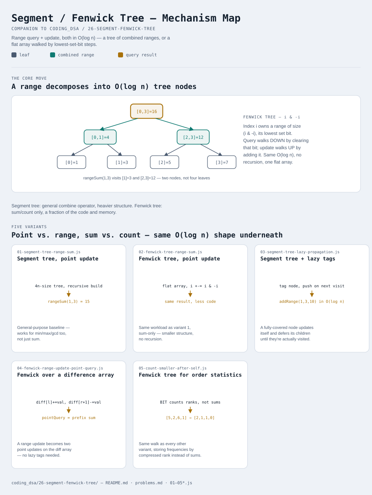

# Segment Tree / Fenwick Tree

Interactive version: [diagram.html](diagram.html) (open in a browser)

## What
- Both structures solve the same problem: an array that needs BOTH range
  queries and updates repeated many times, where a plain array (O(n) range
  query) or a prefix-sum array (O(n) update) is too slow for one side
- A **segment tree** is a binary tree over the array — each node stores
  the combined value (sum, min, max, anything associative) of a
  contiguous range; general-purpose but heavier
- A **Fenwick tree** (Binary Indexed Tree) is a flat array where index
  `i`'s responsibility is defined by `i & -i` (its lowest set bit) — much
  smaller and simpler, but limited to invertible operations like sum
  (no min/max, since there's no way to "subtract" a min)

## When to use it
Applies when:
1. The workload mixes range queries and updates — if it's read-only,
   precompute a prefix-sum array instead; if it's write-only, there's
   nothing to query yet
2. The combining operation matters: sum/count → Fenwick tree is simpler
   and enough; min/max/gcd → segment tree, since those aren't invertible
3. Updates target a single point vs. a whole range: point updates are the
   default shape (variants 1-2); range updates need lazy propagation
   (variant 3) or a difference-array trick (variant 4) to stay O(log n)

## Why it works
- **Segment tree**: any range `[l, r]` decomposes into at most O(log n)
  tree nodes that are either fully inside or fully outside it — so a query
  never has to look at all n leaves individually
- **Fenwick tree**: walking from index `i` toward 0 by repeatedly
  subtracting `i & -i` visits exactly the O(log n) ranges whose sum makes
  up `prefixSum(i)` — walking upward by adding `i & -i` visits exactly the
  O(log n) ancestors that need to change after updating index `i`
- **Lazy propagation**: a range update that fully covers a node doesn't
  need to touch that node's children yet — tag the node "pending +val" and
  only push the tag down the first time something actually looks inside it
- **Difference-array Fenwick**: a range update `[l, r] += val` is just two
  point updates on the array of consecutive differences — `diff[l] += val`
  and `diff[r+1] -= val` — turning a range update into the same O(log n)
  point-update Fenwick tree already built in variant 2
- **Order-statistics Fenwick**: nothing about the BIT walk requires the
  stored quantity to be a sum of VALUES — a BIT that counts FREQUENCIES at
  each rank answers "how many elements smaller than X have I seen" just as
  cheaply

## Five variants

| File | Variant | Use when |
|---|---|---|
| [01-segment-tree-range-sum.js](01-segment-tree-range-sum.js) | Segment tree, point update | general-purpose range query + point update |
| [02-fenwick-tree-range-sum.js](02-fenwick-tree-range-sum.js) | Fenwick tree, point update | same workload, sum-only, smaller structure |
| [03-segment-tree-lazy-propagation.js](03-segment-tree-lazy-propagation.js) | Segment tree + lazy tags | range updates need to stay O(log n), not O(n) per update |
| [04-fenwick-range-update-point-query.js](04-fenwick-range-update-point-query.js) | Fenwick over a difference array | range updates, point queries, without lazy propagation |
| [05-count-smaller-after-self.js](05-count-smaller-after-self.js) | Fenwick tree for order statistics | counting/frequency queries, not sums |

Each file is runnable standalone: `node 0X-name.js` prints a demo run.

See [problems.md](problems.md) for a suggested practice order.
