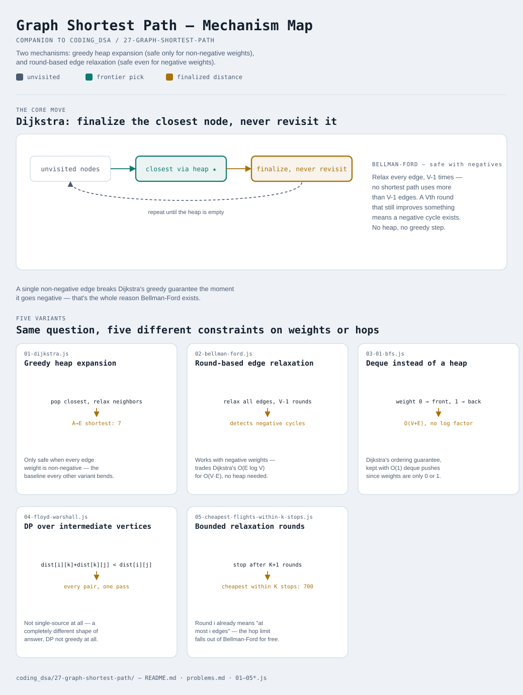

# Graph Shortest Path

Interactive version: [diagram.html](diagram.html) (open in a browser)

## What
- All five variants answer the same question — "what's the shortest
  distance between nodes in a weighted graph" — but the constraints on
  the weights and the shape of the answer needed (one source vs. all
  pairs, unlimited hops vs. a hop budget) change which algorithm is safe
- Two fundamentally different mechanisms show up: **greedy heap expansion**
  (Dijkstra, and its 0-1-weight specialization) vs. **round-based edge
  relaxation** (Bellman-Ford, and its all-pairs/bounded-hop variants)
- This builds directly on [12-union-find](../12-union-find/README.md) and
  [10-graph-bfs-dfs](../10-graph-bfs-dfs/README.md) — shortest PATH here
  assumes you're already comfortable representing a graph and traversing it

## When to use it
Applies when:
1. All weights are non-negative and you need one source's distances to
   everything → Dijkstra (variant 1), or its 0/1-only specialization
   (variant 3) if weights are restricted to exactly 0 or 1
2. ANY weight can be negative → Bellman-Ford (variant 2) — Dijkstra's
   greedy finalization step is unsafe the moment a negative edge exists
3. You need distances between EVERY pair of nodes, not just from one
   source → Floyd-Warshall (variant 4)
4. The path is constrained by a hop/stop limit, not just total weight →
   bounded Bellman-Ford (variant 5)

## Why it works
- **Dijkstra**: finalizing the closest unvisited node is safe only because
  no non-negative edge discovered later could ever shorten an
  already-finalized distance — the moment weights can go negative, that
  guarantee breaks
- **Bellman-Ford**: relaxing every edge V-1 times is enough because any
  shortest path has at most V-1 edges; a Vth round that still improves
  something proves a negative cycle exists
- **0-1 BFS**: a deque keeps distances non-decreasing front-to-back just
  like a heap does, but a 0-weight edge only ever needs to jump to the
  front — no O(log n) heap operations required
- **Floyd-Warshall**: `dist[i][j]` only improves by routing through vertex
  `k` once `dist[i][k]` and `dist[k][j]` are already optimal using earlier
  vertices as waypoints — the same "smaller subproblem first" guarantee
  every DP pattern in this repo relies on
- **Bounded Bellman-Ford**: relaxation round `i` already means "shortest
  path using at most `i` edges" — stopping early at K+1 rounds, and
  relaxing from a snapshot instead of the live array, turns that into a
  hop-limited shortest path for free

## Five variants

| File | Variant | Use when |
|---|---|---|
| [01-dijkstra.js](01-dijkstra.js) | Greedy heap expansion | single source, non-negative weights |
| [02-bellman-ford.js](02-bellman-ford.js) | Round-based edge relaxation | negative weights allowed, or need to detect a negative cycle |
| [03-01-bfs.js](03-01-bfs.js) | Deque instead of a heap | weights are only ever 0 or 1 |
| [04-floyd-warshall.js](04-floyd-warshall.js) | DP over intermediate vertices | need distances between every pair of nodes |
| [05-cheapest-flights-within-k-stops.js](05-cheapest-flights-within-k-stops.js) | Bounded relaxation rounds | path is constrained by a hop/stop limit |

Each file is runnable standalone: `node 0X-name.js` prints a demo run.

See [problems.md](problems.md) for a suggested practice order.
