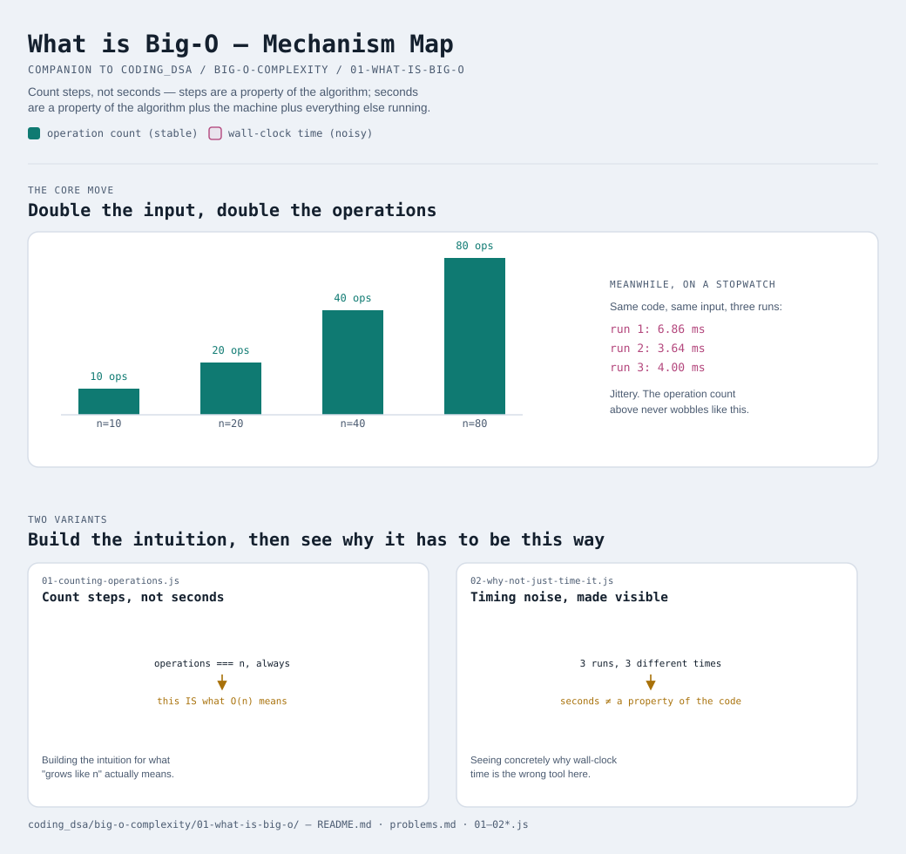

# What is Big-O (and why do we need it)?



Interactive version: [diagram.html](diagram.html) (open in a browser)

## The problem Big-O exists to solve
Say you write a function, and someone asks "is it fast?" You could time
it: "0.003 seconds." But that answer is almost useless on its own —
fast compared to what input size? On what computer? While what else was
running? Tomorrow, on a different laptop, with a bigger input, that
same "0.003 seconds" tells you nothing.

What you actually want to know is: **if the input gets twice as big, does
the work double? Quadruple? Stay the same?** That question has an answer
that doesn't depend on your CPU, your language, or what else is open in
your browser right now. Big-O is just a name for THAT answer.

## The core idea: count steps, not seconds
Instead of a stopwatch, imagine counting how many basic operations
(comparisons, additions, array accesses) a function performs, as a
function of the input size `n`. [01-counting-operations.js](01-counting-operations.js)
does exactly that for a simple loop:

```
n = 10       -> 10 operations
n = 100      -> 100 operations
n = 1,000    -> 1,000 operations
n = 10,000   -> 10,000 operations
```

Operations always equal `n`, exactly, every time, on every machine. THAT
relationship — "work grows in direct proportion to `n`" — is what we
write as **O(n)**. The "O" literally stands for "Order of" — as in,
"this function's work is on the order of `n`."

## Why not just use a stopwatch, then?
Because wall-clock time is noisy in a way step-counting isn't.
[02-why-not-just-time-it.js](02-why-not-just-time-it.js) times the exact
same function on the exact same input three times in a row and gets
three different numbers — CPU scheduling, background processes, and
JIT warmup all add jitter that has nothing to do with the algorithm
itself. Big-O measures something that doesn't wobble: the SHAPE of how
work grows, stripped of every machine-specific detail.

## What Big-O deliberately throws away
Big-O isn't trying to predict your exact runtime — it's trying to answer
one narrower, more durable question: as `n` grows very large, what shape
does the growth curve take? To get there, it throws away:
- **Constants**: a function doing `2n` steps and one doing `500n` steps
  are BOTH "O(n)" — they both grow in a straight line, the STEEPNESS of
  that line isn't what Big-O tracks (see
  [02-time-complexity-classes](../02-time-complexity-classes/README.md)
  for why this is a deliberate choice, not an oversight)
- **Lower-order terms**: a function doing `n² + n` steps is written as
  `O(n²)` — for large `n`, the `n²` term completely dominates the `n`
  term, so keeping the smaller term around adds noise without adding
  useful information
- **Small-input behavior**: Big-O describes what happens as `n` gets
  large ("asymptotic" behavior) — an algorithm can be slower than
  another for small inputs and still have better Big-O, if it wins out
  once `n` is big enough

None of this is Big-O being sloppy — it's Big-O being precise about the
ONE question it's built to answer, and refusing to answer questions
(exact runtime, small-input performance) it was never meant to.

## Two variants

| File | Variant | Use when |
|---|---|---|
| [01-counting-operations.js](01-counting-operations.js) | Count steps, not seconds | building the intuition for what "grows like n" actually means |
| [02-why-not-just-time-it.js](02-why-not-just-time-it.js) | Timing noise, made visible | seeing concretely why wall-clock time is the wrong tool for this question |

Each file is runnable standalone: `node 0X-name.js` prints a demo run.

See [problems.md](problems.md) for a suggested practice order.
