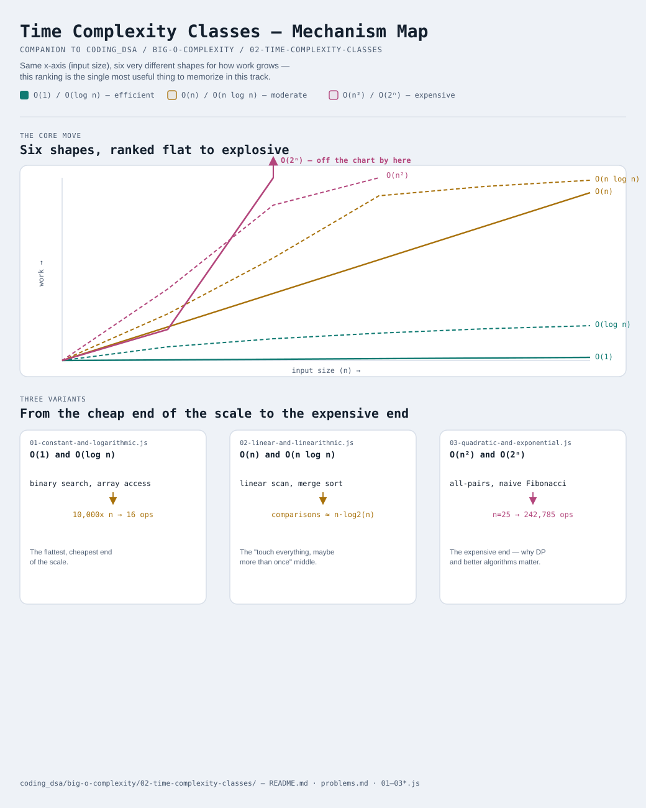

# Time Complexity Classes



Interactive version: [diagram.html](diagram.html) (open in a browser)

## The ranked list, fastest to slowest
There's a small, well-known set of shapes that almost every algorithm's
growth curve falls into. Worth memorizing this order cold — it's the
single most useful piece of vocabulary in this entire track:

```
O(1)  <  O(log n)  <  O(n)  <  O(n log n)  <  O(n²)  <  O(2ⁿ)
flat     barely       straight   slightly      curves     explodes
         grows         line      steeper       upward     upward
                                  than n
```

## O(1) — Constant
The work is the same regardless of `n`. `arr[0]`, `map.get(key)`,
checking `arr.length` — none of these get slower as the collection
grows, because none of them need to LOOK at the collection to answer.

## O(log n) — Logarithmic
The work grows, but each additional unit of input only adds a TINY bit
of work, because each step throws away HALF of what's left. Binary
search ([16-modified-binary-search](../../16-modified-binary-search/README.md))
is the textbook case: [01-constant-and-logarithmic.js](01-constant-and-logarithmic.js)
shows `n` growing 10,000x (from 10 to 100,000) while the operation count
only grows from 3 to 16. That's the entire appeal of "divide the search
space in half every step."

## O(n) — Linear
Touch every element once. Double the input, double the work — a
straight-line relationship, the most intuitive shape on this list and
the one most loops naturally produce.

## O(n log n) — Linearithmic
Touch every element, but combined with a log-n-shaped amount of extra
work per pass. This is the signature of "divide the problem in half,
solve each half, recombine" algorithms — merge sort is the textbook
case, and [02-linear-and-linearithmic.js](02-linear-and-linearithmic.js)
counts its comparisons directly to show the `n·log₂(n)` shape isn't just
a label, it's a countable fact. This is also the best possible
complexity for any COMPARISON-based sort — nothing that only compares
two elements at a time can reliably beat it.

## O(n²) — Quadratic
A loop inside a loop, both running roughly `n` times — checking every
PAIR of elements. Doubling `n` roughly QUADRUPLES the work, not doubles
it: [03-quadratic-and-exponential.js](03-quadratic-and-exponential.js)
shows exactly that pattern (`n=10 -> 100 ops`, `n=80 -> 6,400 ops` — an
8x growth in `n` becomes a 64x growth in work).

## O(2ⁿ) — Exponential
Work DOUBLES with every single additional element. The classic sign is
naive recursion that branches into two (or more) calls per level — the
textbook recursive Fibonacci with no memoization is exactly this shape.
[03-quadratic-and-exponential.js](03-quadratic-and-exponential.js) shows
`n=25` needing 242,785 operations for a function that "just adds two
numbers together" a handful of times conceptually — this explosive
growth is the entire reason
[19-01-knapsack](../../19-01-knapsack/README.md) and
[21-lcs-family](../../21-lcs-family/README.md) exist: dynamic programming
is fundamentally a technique for turning exponential re-computation into
something far cheaper by remembering answers instead of re-deriving them.

## Why constants get dropped (a common point of confusion)
An algorithm doing `3n` steps and one doing `n` steps are BOTH "O(n)" —
that can feel wrong the first time you see it, since `3n` is clearly
more work. But Big-O isn't ranking exact step counts, it's ranking
GROWTH SHAPES: as `n` gets very large, the difference between "3 times
as many steps" and "1 times as many steps" is a rounding error compared
to the difference between "grows in a straight line" (any linear
function) and "grows as a square" (any quadratic function). The
constant matters for real-world performance tuning; the shape is what
Big-O exists to describe.

## Three variants

| File | Variant | Use when |
|---|---|---|
| [01-constant-and-logarithmic.js](01-constant-and-logarithmic.js) | O(1) and O(log n) | the flattest, cheapest end of the scale |
| [02-linear-and-linearithmic.js](02-linear-and-linearithmic.js) | O(n) and O(n log n) | the "touch everything, maybe more than once" middle |
| [03-quadratic-and-exponential.js](03-quadratic-and-exponential.js) | O(n²) and O(2ⁿ) | the expensive end — the shapes that make DP and better algorithms worth the trouble |

Each file is runnable standalone: `node 0X-name.js` prints a demo run.

See [problems.md](problems.md) for a suggested practice order.
