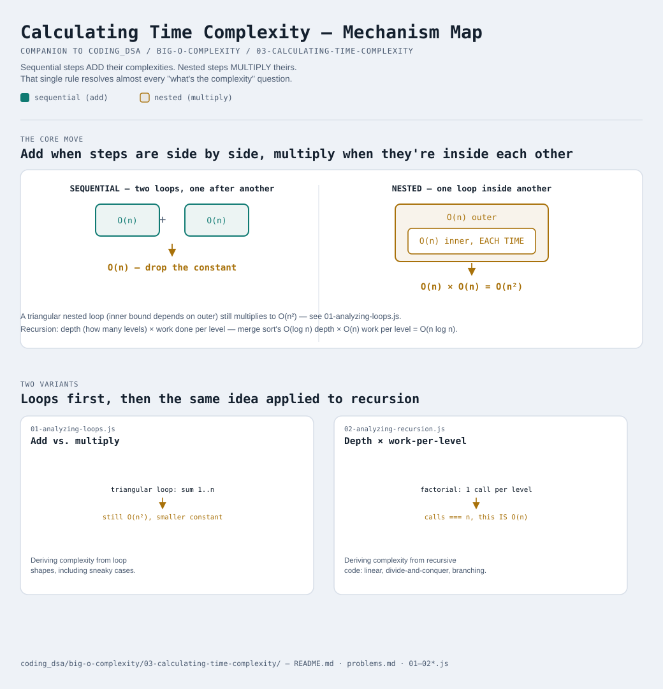

# Calculating Time Complexity



Interactive version: [diagram.html](diagram.html) (open in a browser)

Module 2 taught you to RECOGNIZE the six shapes. This module teaches you
to DERIVE which shape a piece of code you've never seen before belongs
to — the actual skill an interview is testing when it asks "what's the
time complexity of this?"

## The one rule that answers almost everything: add vs. multiply
**Sequential** steps (one after another) ADD their complexities.
**Nested** steps (one inside another) MULTIPLY theirs. That's it — that
single distinction resolves the vast majority of "what's the complexity"
questions you'll ever be asked.

```
for (...) { }        O(n)
for (...) { }        + O(n)
                      -----------
                      O(2n) -> drop the constant -> O(n)   (SEQUENTIAL: add)

for (...) {
  for (...) { }       O(n) inside O(n)
}
                      -----------
                      O(n) x O(n) = O(n²)                  (NESTED: multiply)
```

[01-analyzing-loops.js](01-analyzing-loops.js) counts real operations for
both shapes side by side, plus a sneaky third case: a nested loop whose
INNER bound depends on the outer variable (`for j = 0 to i` instead of
`for j = 0 to n`). It's tempting to call that "not really quadratic"
since the inner loop shrinks — but summing `1 + 2 + 3 + ... + n` gives
`n(n+1)/2`, and after dropping the constant and the lower-order `n`
term, that's still `O(n²)`. The file's demo shows both nested shapes
roughly quadrupling when `n` doubles, which is the real quadratic
signature, regardless of the smaller constant.

## Recursion: count calls, and how much work happens per level
Recursive code doesn't have visible loops to count, so the technique
shifts slightly — but it's the same underlying question: how much TOTAL
work happens, added up across everything the function does?

**Linear recursion** — one recursive call per invocation (like
`factorial(n) = n * factorial(n - 1)`) — makes exactly as many calls as
there are levels of depth. [02-analyzing-recursion.js](02-analyzing-recursion.js)
confirms this directly: `factorial(20)` makes exactly 20 calls. Depth
IS the call count here, so depth O(n) means O(n) total work.

**Divide-and-conquer recursion** — splits the input in half each call,
then does some work to recombine (merge sort's merge step) — has TWO
numbers to multiply instead of one to count: how many LEVELS deep the
splitting goes (`O(log n)`, since halving repeatedly is exactly the
"throw away half each step" shape from
[02-time-complexity-classes](../02-time-complexity-classes/README.md)),
and how much work happens per level (`O(n)`, since the combined
recombination work across every subproblem AT one level always adds back
up to roughly the original `n`). Multiply those: `O(n) x O(log n) =
O(n log n)` — which is exactly the shape merge sort turned out to have
when [module 2](../02-time-complexity-classes/README.md) counted its
comparisons directly.

**Branching recursion** — more than one recursive call per invocation
with NO shrinking input (naive Fibonacci calling itself twice on
`n-1` AND `n-2`) — is what produces `O(2ⁿ)`. The giveaway is structural:
count how many recursive calls one invocation makes. One call ->
depth-bounded. Two-or-more calls without the input shrinking fast enough
to compensate -> exponential blowup.

## The three-question checklist
When you see code and need its complexity, ask, in order:
1. **Loops**: are they sequential (add) or nested (multiply)? Does an
   inner bound depend on an outer variable (still counts by its actual
   total, usually still the "obvious" complexity after dropping
   constants)?
2. **Recursion**: how many recursive calls does one invocation make? One
   -> complexity tracks depth. More than one -> check whether the input
   actually shrinks fast enough to keep total work bounded (divide-and-
   conquer) or explodes (naive branching).
3. **Everything else**: is there a hidden loop inside a library call
   (`array.includes()` is O(n), not O(1)) or a data structure operation
   that isn't O(1) (searching an unsorted linked list is O(n))? The
   biggest source of wrong complexity analysis in practice is missing a
   cost like this hiding inside a single, innocent-looking line.

## Two variants

| File | Variant | Use when |
|---|---|---|
| [01-analyzing-loops.js](01-analyzing-loops.js) | Add vs. multiply | deriving complexity from loop shapes, including the sneaky triangular case |
| [02-analyzing-recursion.js](02-analyzing-recursion.js) | Depth × work-per-level | deriving complexity from recursive code, linear vs. divide-and-conquer vs. branching |

Each file is runnable standalone: `node 0X-name.js` prints a demo run.

See [problems.md](problems.md) for a suggested practice order.
