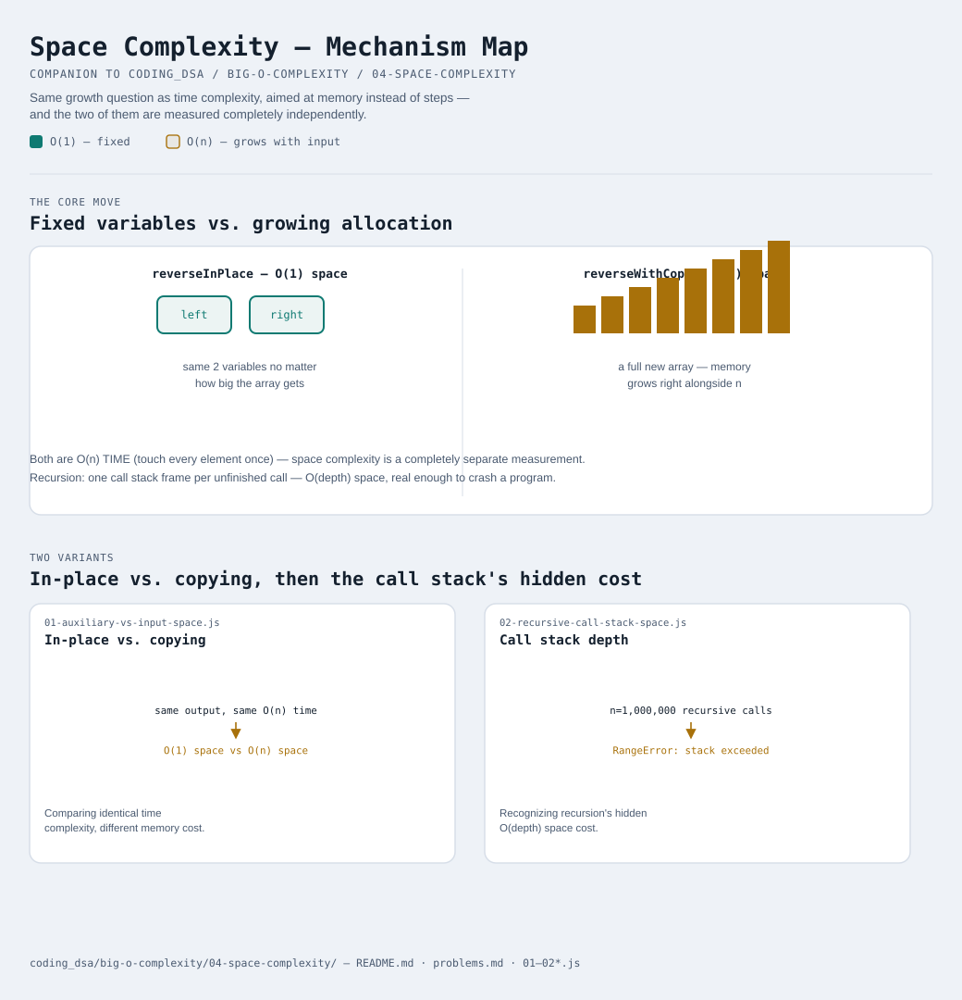

# Space Complexity

Interactive version: [diagram.html](diagram.html) (open in a browser)

## Same question, different resource
Everything from modules 1-3 asked "how does the WORK grow as n grows?"
Space complexity asks the identical question about a different resource:
"how does the MEMORY grow as n grows?" Same six shapes from
[02-time-complexity-classes](../02-time-complexity-classes/README.md)
apply — O(1), O(n), O(n²), and so on — just measuring bytes allocated
instead of steps taken.

## What "space complexity" usually means in practice: auxiliary space
The input has to live in memory no matter what you do with it — that
cost is unavoidable and usually not what people mean by "what's the
space complexity of your solution?" What they're really asking about is
**auxiliary space**: memory your function allocates ON TOP OF the input,
that wouldn't exist if you didn't write the code the way you did.

[01-auxiliary-vs-input-space.js](01-auxiliary-vs-input-space.js) makes
this concrete with two functions that do the exact same job — reverse an
array — and produce the exact same output:
- `reverseInPlace`: swaps elements directly inside the given array using
  two index variables. No matter how big the array is, it only ever
  needs those two variables — **O(1) auxiliary space**.
- `reverseWithCopy`: builds a brand new array of the same size to hold
  the reversed result — **O(n) auxiliary space**.

Both are O(n) TIME (each touches every element once) — but their SPACE
complexity is completely different. This is worth sitting with: **time
complexity and space complexity are independent measurements.** A
function's Big-O time tells you nothing about its Big-O space, and
there's very often a real tradeoff between the two (see
[05-applying-big-o](../05-applying-big-o/README.md)).

## Recursion has a space cost most people don't think about
Every recursive call adds a new "stack frame" — memory holding that
call's local variables and where execution should resume once it
returns. Those frames aren't freed until the call actually returns, so a
recursive function that goes `n` levels deep before hitting its base
case is using **O(n) space**, purely from the call stack, even if each
individual frame is tiny.

[02-recursive-call-stack-space.js](02-recursive-call-stack-space.js)
tracks this directly: `factorialRecursive(20)` reaches a maximum call
stack depth of exactly 20, while `factorialIterative` — computing the
identical result with a loop — uses the same two variables (`result`,
`i`) regardless of whether `n` is 20 or 20,000. Recursive: O(n) space.
Iterative: O(1) space. Same output, same O(n) TIME complexity, different
SPACE complexity — recursion trades space for the readability of "let
the call stack track my progress for me."

This isn't just theoretical: the file's final demo calls
`factorialRecursive(1_000_000)` and it genuinely CRASHES —
`RangeError: Maximum call stack size exceeded`. The call stack is a real,
finite region of memory (see
[heap-fundamentals](../../heap-fundamentals/README.md) for how it
contrasts with the OTHER kind of memory, the heap), and O(n) recursive
space eventually hits that ceiling for real.

## Two variants

| File | Variant | Use when |
|---|---|---|
| [01-auxiliary-vs-input-space.js](01-auxiliary-vs-input-space.js) | In-place vs. copying | comparing two solutions with identical time complexity but different memory cost |
| [02-recursive-call-stack-space.js](02-recursive-call-stack-space.js) | Call stack depth | recognizing that recursion has a hidden O(depth) space cost, iteration doesn't |

Each file is runnable standalone: `node 0X-name.js` prints a demo run.

See [problems.md](problems.md) for a suggested practice order.
