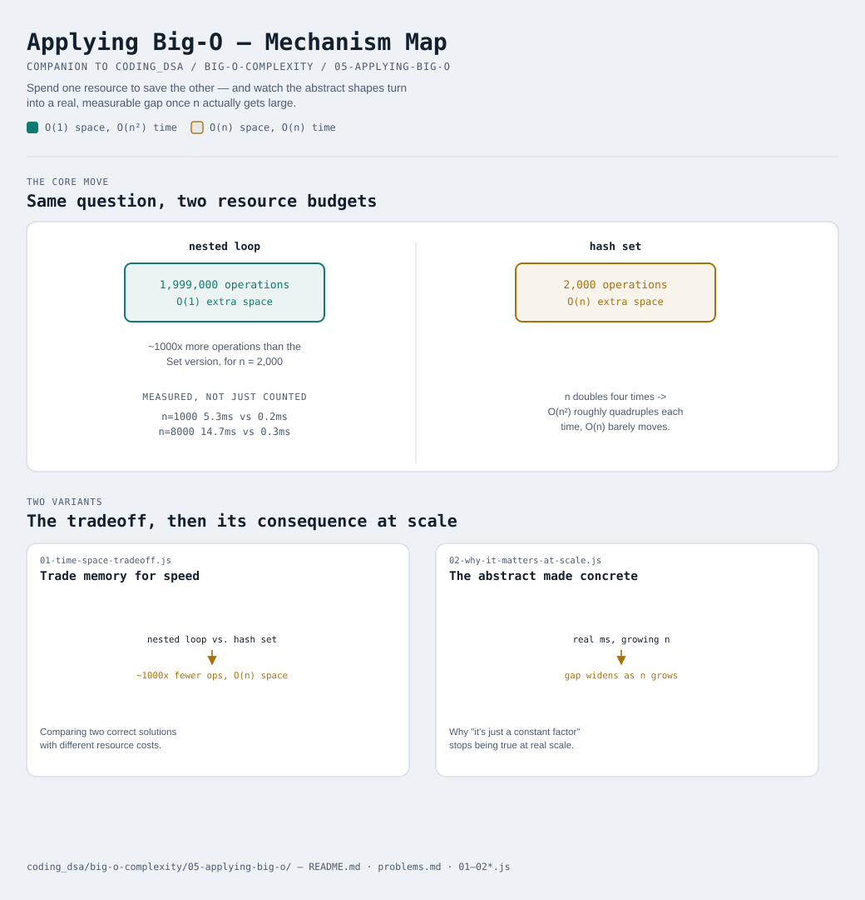

# Applying Big-O

Interactive version: [diagram.html](diagram.html) (open in a browser)

Modules 1-4 built the vocabulary and the technique. This last module asks
the question everything else was in service of: **so what?** Why does
any of this matter outside of an interview room, and how do you actually
USE it when writing real code?

## The time-space tradeoff
The most common real decision Big-O informs isn't "which is faster" in
the abstract — it's "I have a fixed amount of ONE resource, how much of
the OTHER can I spend to get more of it?"
[01-time-space-tradeoff.js](01-time-space-tradeoff.js) makes this
concrete with the classic "does this array contain a duplicate" problem,
solved two ways:
- **Nested loop**: check every pair directly. O(n²) time, O(1) extra
  space — no memory beyond a couple of loop variables, but potentially
  millions of comparisons for large inputs.
- **Hash set**: remember every value seen so far, checking each new one
  against what's been seen. O(n) time, O(n) extra space — one pass
  through the array, at the cost of storing up to the whole array again.

For `n = 2,000` with no duplicate present (forcing the worst case for
both), the nested loop does about 1,000x more operations than the Set
version. That's the trade laid bare: spending O(n) memory buys back
roughly a factor of `n` in speed. Neither approach is "the right one" in
general — a memory-constrained embedded device might prefer the O(1)-space
version even at a real time cost; a web server answering requests in
milliseconds will almost always take the O(n)-space version instead.

## Why the abstract shapes become concrete at scale
[02-why-it-matters-at-scale.js](02-why-it-matters-at-scale.js) times both
versions on genuinely growing inputs (1,000 up to 8,000 elements) and
watches the gap widen in real milliseconds, not just operation counts.
This is a DIFFERENT use of a stopwatch than
[01-what-is-big-o](../01-what-is-big-o/README.md) warned against —
there, the goal was DISCOVERING an algorithm's complexity class (where a
stopwatch is unreliable); here, the complexity classes are already
known, and timing is just making their real-world CONSEQUENCE visible.
At small `n`, an O(n²) algorithm might genuinely be fine — simpler code,
negligible actual delay. The problem shows up specifically once `n`
grows: doubling the input roughly QUADRUPLES an O(n²) algorithm's work,
while an O(n) algorithm's work merely doubles. Code that felt
instantaneous in testing with 100 rows can take a production database
down once a table has 10 million rows — same code, same Big-O, wildly
different lived experience depending on scale.

## Where the rest of this repo already made these choices for you
Big-O isn't just theory floating above this repo — it's the reason
almost every pattern module exists in the first place:
- [14-top-k-elements](../../14-top-k-elements/README.md) trades a small
  amount of extra heap space for avoiding a full O(n log n) sort when
  only the top K elements are actually needed
- [19-01-knapsack](../../19-01-knapsack/README.md) and
  [21-lcs-family](../../21-lcs-family/README.md) spend O(n·m) space on a
  memo table specifically to avoid the O(2ⁿ) blowup naive recursion would
  otherwise hit — the exact trade this module has been building toward
- [26-segment-fenwick-tree](../../26-segment-fenwick-tree/README.md)
  spends extra space building a tree structure up front specifically to
  turn repeated O(n) range queries into O(log n) ones

None of these are exotic — they're all just this module's core idea
(spend one resource to save the other) applied to a specific problem
shape. Once time-space tradeoffs stop feeling like a special interview
topic and start feeling like the obvious question to ask about any
solution, this whole track has done its job.

## Two variants

| File | Variant | Use when |
|---|---|---|
| [01-time-space-tradeoff.js](01-time-space-tradeoff.js) | Trade memory for speed | comparing two correct solutions to the same problem with different resource costs |
| [02-why-it-matters-at-scale.js](02-why-it-matters-at-scale.js) | The abstract made concrete | seeing why "it's just a constant factor" stops being true once n gets large enough |

Each file is runnable standalone: `node 0X-name.js` prints a demo run.

See [problems.md](problems.md) for a suggested practice order.

## You made it
That's the whole track. Big-O isn't a separate skill from the patterns
and data structures elsewhere in this repo — it's the lens that explains
WHY each of them is shaped the way it is. Worth re-reading a module or
two from [Patterns](../../index.md) with this track's vocabulary fresh —
"why does this use a heap instead of sorting" or "why does this DP table
have this shape" usually has a Big-O answer now.
