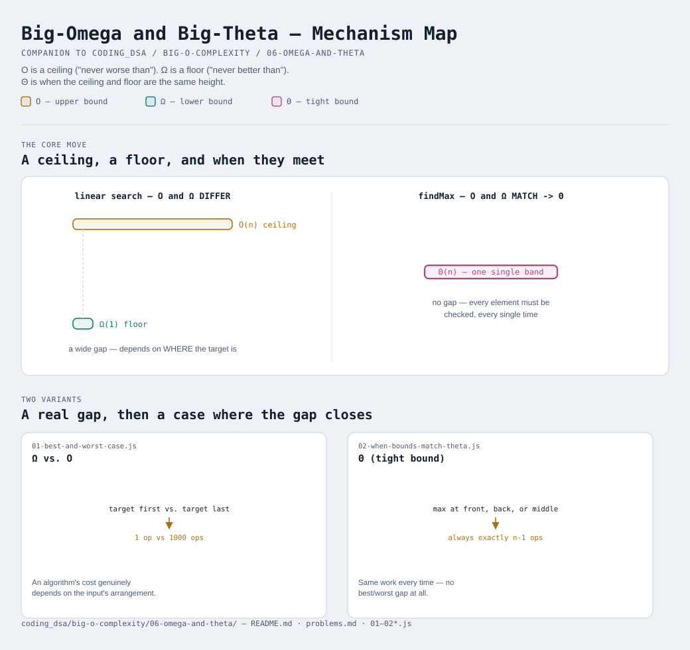

# Big-Omega and Big-Theta



Interactive version: [diagram.html](diagram.html) (open in a browser)

Every earlier module in this track used "Big-O" as a stand-in for "the
complexity" in general — which is how almost everyone talks day to day,
but it's not the whole picture. Big-O is one of THREE standard
notations, and knowing what the other two actually mean clears up a
question that trips people up the first time it's asked directly: "is
Big-O the worst case, the best case, or the average case?"

## The delivery-estimate analogy
- **Big-O (O)** — an UPPER bound. "This delivery takes AT MOST 2 hours."
  It might arrive sooner, but it's guaranteed not to take longer.
- **Big-Omega (Ω)** — a LOWER bound. "This delivery takes AT LEAST 20
  minutes." It's guaranteed not to arrive any faster than that, no
  matter how lucky the traffic is.
- **Big-Theta (Θ)** — a TIGHT bound. "This delivery reliably takes about
  45 minutes." Both the ceiling AND the floor are the same number — no
  best-case/worst-case gap at all.

## Why linear search needs TWO different bounds
[01-best-and-worst-case.js](01-best-and-worst-case.js) runs linear
search twice on the same 1,000-element array — once where the target is
the very first element, once where it's the very last:

```
target is first  ->  1 operation     (best case  — Ω(1))
target is last    ->  1000 operations (worst case — O(n))
```

Same algorithm, same input SIZE, wildly different operation counts —
because how much work linear search does depends entirely on WHERE the
target happens to be, not just on how big the array is. That's exactly
why "linear search is O(n)" and "linear search is Ω(1)" are BOTH true
statements at the same time, describing different things: O(n) says
"never worse than this," Ω(1) says "could be as good as this," and
neither one, alone, tells you which case you're actually going to hit.

## When O and Ω meet: Big-Theta
Some algorithms don't have a best-case/worst-case gap at all —
[02-when-bounds-match-theta.js](02-when-bounds-match-theta.js)
demonstrates this with "find the maximum value in an unsorted array."
There is NO way to guarantee you've found the true maximum without
checking every single element — the max could always be hiding in
whichever spot you decided to skip. So the operation count is IDENTICAL
whether the max sits at the front, the back, or the middle:

```
max at the front  ->  9 operations
max at the back    ->  9 operations
max in the middle  ->  9 operations
```

Best case and worst case are the exact same function here, so this
algorithm gets the tightest possible label: **Θ(n)**, not just O(n) or
Ω(n) individually.

## So why does everyone just say "Big-O" in practice?
Two honest reasons:
1. **The worst case is usually what you actually care about.** A system
   that's occasionally fast but sometimes catastrophically slow is
   riskier than one that's reliably mediocre — Big-O's "never worse than
   this" guarantee is the number that protects you from surprises, which
   is why it dominates casual conversation and interviews alike.
2. **For a large share of common algorithms, O and Θ coincide anyway.**
   Anything that MUST touch every element to be correct (summing an
   array, finding a max, copying a list) has no best-case/worst-case gap
   at all — so casually saying "O(n)" about `findMax` is ALSO,
   technically, a Θ(n) claim, even though almost nobody bothers to say
   "Θ" out loud. The distinction only becomes worth naming explicitly
   when an algorithm's best and worst case genuinely diverge, the way
   linear search's do.

## Two variants

| File | Variant | Use when |
|---|---|---|
| [01-best-and-worst-case.js](01-best-and-worst-case.js) | Ω (lower bound) vs. O (upper bound) | an algorithm's cost genuinely depends on the input's arrangement, not just its size |
| [02-when-bounds-match-theta.js](02-when-bounds-match-theta.js) | Θ (tight bound) | an algorithm does the same amount of work every time, no best/worst gap |

Each file is runnable standalone: `node 0X-name.js` prints a demo run.

See [problems.md](problems.md) for a suggested practice order.

## You made it — for real this time
That's the complete picture: O, Ω, and Θ together are what "asymptotic
notation" means as a whole. Everything in modules 1-5 was technically
about Big-O specifically; now you know what it leaves out, and why that
omission is usually — but not always — safe to make.
