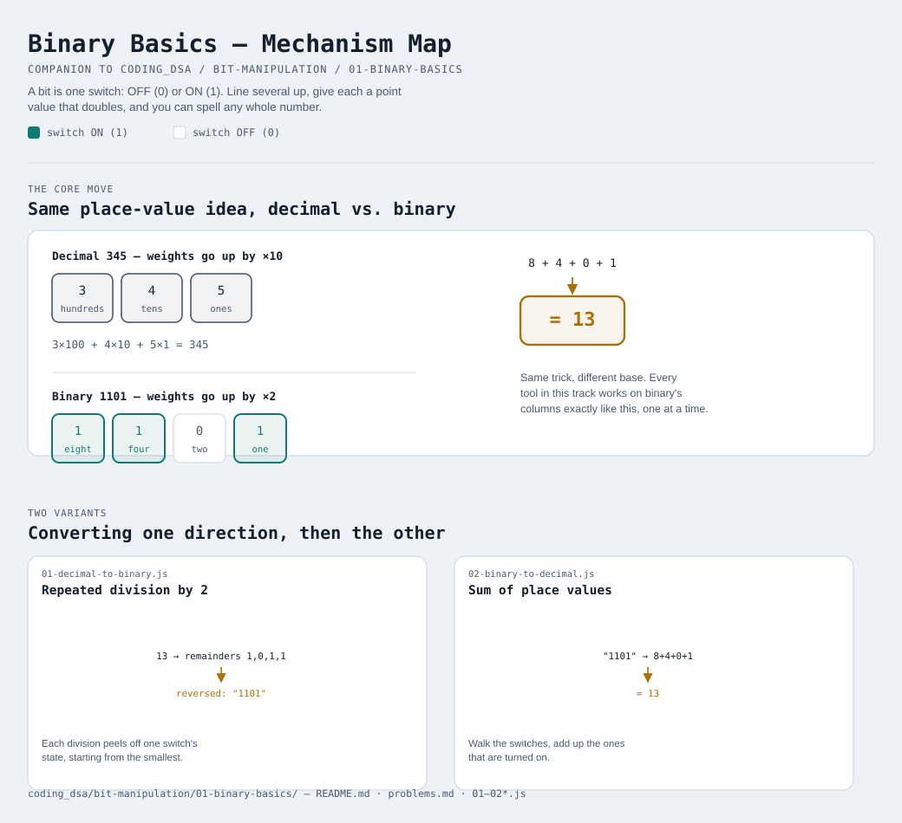

# Binary Basics



Interactive version: [diagram.html](diagram.html) (open in a browser)

## What is a "bit", really?
A bit is just ONE switch. It can only be in two states: OFF (`0`) or ON
(`1`). That's it — that's the entire idea. Everything else in this whole
track is just "what can you build once you line up a bunch of these
switches in a row?"

Computers use bits (not the digits 0-9 you're used to) because a switch
that's only ever fully-off or fully-on is cheap and reliable to build in
hardware — a wire is either carrying voltage or it isn't. That's the
whole reason binary exists: it's not a math trick, it's an engineering
choice.

## The number system you already know, slowed down
You already know how to read the decimal number `345` — but you've never
had to think about WHY it means what it means. Each digit's position has
a "weight":

```
  3       4       5
  |       |       |
  hundreds tens   ones
  (10²)   (10¹)   (10⁰)

  345 = 3×100 + 4×10 + 5×1
```

Binary works EXACTLY the same way, except the weight of each position is
a power of **2** instead of a power of **10** — because there are only 2
symbols (`0` and `1`) instead of 10 symbols (`0`-`9`):

```
  1     1     0     1
  |     |     |     |
  8     4     2     1
 (2³)  (2²)  (2¹)  (2⁰)

  1101 = 1×8 + 1×4 + 0×2 + 1×1 = 13
```

That's the whole trick. Binary `1101` and decimal `13` are the exact same
number — just written down using a different set of symbols and a
different set of position-weights.

## The light switch picture
Imagine 4 light switches in a row, each labeled with a point value:
`8 4 2 1`. To "spell" the number 13 with switches, turn ON exactly the
switches whose points add up to 13:

```
switch:  [8]  [4]  [2]  [1]
value:    8  + 4  + 0  + 1  = 13
state:    ON   ON   OFF  ON
binary:    1    1    0    1
```

Every whole number has exactly one way to do this — that's why every
decimal number has exactly one binary form. More switches (more bits) just
means bigger point values available (16, 32, 64, 128, ...), so you can
spell bigger numbers.

## Converting decimal → binary (by hand)
The mechanical way to find which switches to flip: keep dividing by 2 and
write down the remainder (0 or 1) each time. Read the remainders bottom
to top.

```
13 ÷ 2 = 6  remainder 1   ← least significant bit (written last, read first)
 6 ÷ 2 = 3  remainder 0
 3 ÷ 2 = 1  remainder 1
 1 ÷ 2 = 0  remainder 1   ← most significant bit (written first, read last)

Read remainders bottom-to-top: 1101
```

## Converting binary → decimal (by hand)
The reverse: multiply each digit by its position's weight and add them up
— exactly like the `1101 = 8+4+0+1 = 13` example above.

## Why this matters before touching any "bit tricks"
Every operator and trick in modules 2-5 works on these place-value
positions ONE AT A TIME. If "binary is just place value with weights that
double instead of going by tens" isn't solid yet, none of the later
tricks will feel like anything other than magic — they're not magic, they're
just this idea applied column by column.

## Two variants

| File | Variant | Use when |
|---|---|---|
| [01-decimal-to-binary.js](01-decimal-to-binary.js) | Repeated division by 2 | you have a normal number and want to see its switches |
| [02-binary-to-decimal.js](02-binary-to-decimal.js) | Sum of place values | you have a row of switches and want to know what number they spell |

Each file is runnable standalone: `node 0X-name.js` prints a demo run.

See [problems.md](problems.md) for a suggested practice order.
