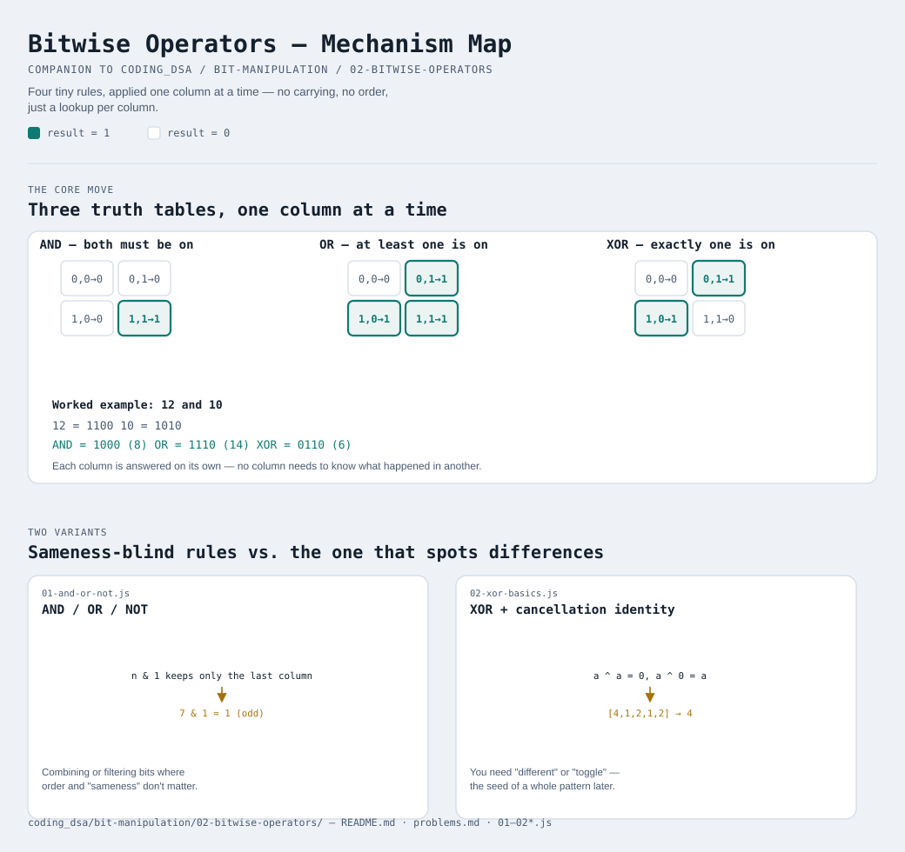

# Bitwise Operators



Interactive version: [diagram.html](diagram.html) (open in a browser)

## The one idea this whole module rests on
Every bitwise operator compares two numbers **one column at a time**,
exactly like lining up `345` and `128` under each other and adding digit
by digit — except instead of "add with carrying", the rule is one of four
very small, very dumb rules. There's no cleverness here, just four rules
applied over and over, one column at a time.

## AND ( `&` ) — "both must be on"
Think of a lock that needs TWO keys turned at once before it opens.
Neither key alone does anything.

| A | B | A AND B |
|---|---|---------|
| 0 | 0 | 0 |
| 0 | 1 | 0 |
| 1 | 0 | 0 |
| 1 | 1 | **1** |

Only the `1,1` row produces a `1`. Everything else produces `0`.

## OR ( `\|` ) — "at least one is on"
Think of a doorbell wired to two buttons — the front door button and the
back door button. Press EITHER one (or both) and the bell rings.

| A | B | A OR B |
|---|---|--------|
| 0 | 0 | 0 |
| 0 | 1 | **1** |
| 1 | 0 | **1** |
| 1 | 1 | **1** |

Everything produces a `1` except the `0,0` row.

## XOR ( `^` ) — "exactly one is on, not both"
Think of a hallway light with two switches, one at each end (a real
electrician's wiring pattern). Flipping EITHER switch toggles the light —
but if BOTH are flipped, you're back to where you started.

| A | B | A XOR B |
|---|---|---------|
| 0 | 0 | 0 |
| 0 | 1 | **1** |
| 1 | 0 | **1** |
| 1 | 1 | 0 |

This is the odd one out compared to AND/OR: the `1,1` row goes back to
`0`. That single fact — "two of the same thing cancels back to zero" —
is the entire idea behind [18-bitwise-xor](../../18-bitwise-xor/README.md)
later on. Two identities worth memorizing right now:

```
a ^ a = 0    (a thing XORed with itself always cancels to 0)
a ^ 0 = a    (XORing with 0 changes nothing)
```

## NOT ( `~` ) — "flip it"
The only operator that looks at ONE number, not two. Every `0` becomes a
`1` and every `1` becomes a `0`.

| A | NOT A |
|---|-------|
| 0 | **1** |
| 1 | **0** |

(In JavaScript, `~n` actually gives you `-(n + 1)` because numbers are
stored with a sign bit — that surprises almost everyone the first time.
[04-bit-tricks](../04-bit-tricks/README.md) shows the workaround for when
you just want "flip these specific bits" without the sign surprise.)

## Worked example: combine two whole numbers
Line up `12` and `10` in binary, then apply a rule to every column:

```
  12 = 1 1 0 0
  10 = 1 0 1 0
       -------
 AND  = 1 0 0 0  = 8    (only column 1 has two 1s)
 OR   = 1 1 1 0  = 14   (every column except column 3 has at least one 1)
 XOR  = 0 1 1 0  = 6    (columns where they DISAGREE)
```

Notice `AND` and `OR` never need the other operand at any OTHER column —
each column is answered completely on its own. That's why these
operators are so fast: no carrying, no borrowing, just 32 (or 64)
independent tiny decisions made in parallel.

## Two variants

| File | Variant | Use when |
|---|---|---|
| [01-and-or-not.js](01-and-or-not.js) | AND / OR / NOT | combining or filtering bits where order and "sameness" don't matter |
| [02-xor-basics.js](02-xor-basics.js) | XOR + its cancellation identity | you need "different" or "toggle" — the identity `a^a=0` is the seed of a whole pattern later |

Each file is runnable standalone: `node 0X-name.js` prints a demo run.

See [problems.md](problems.md) for a suggested practice order.
