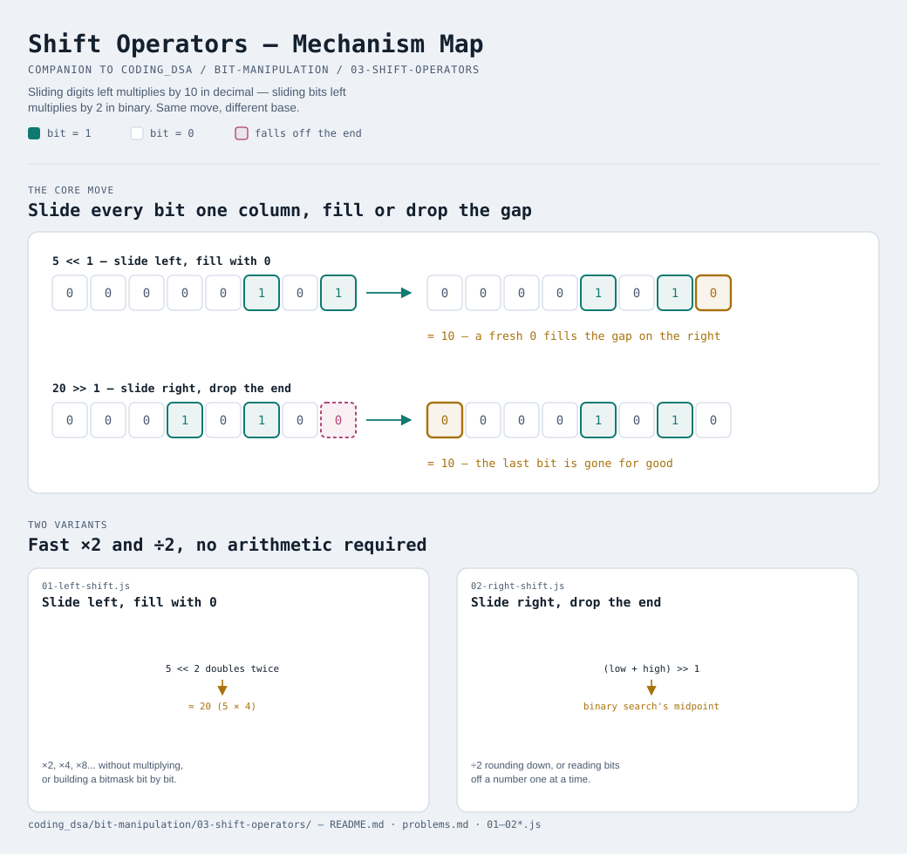

# Shift Operators



Interactive version: [diagram.html](diagram.html) (open in a browser)

## The everyday version of this idea
You already know this trick in decimal, you just never called it
"shifting". Multiplying `23` by `10` doesn't require doing any real math —
you just slide every digit one place to the left and drop a `0` in behind:

```
23 × 10 = 230        (slide left, fill with a 0)
230 ÷ 10 = 23         (slide right, drop the last digit)
```

Shifting in binary is the exact same move, except because binary's
place-value column is worth **×2** instead of ×10, sliding by one column
multiplies (or divides) by 2 instead of by 10.

## Left shift ( `<<` ) — multiply by 2, per shift
Every bit slides one column to the left; a `0` fills in on the right.

```
   5 = 0000 0101
5<<1 = 0000 1010  = 10   (slid once  → ×2)
5<<2 = 0001 0100  = 20   (slid twice → ×4)
5<<3 = 0010 1000  = 40   (slid three times → ×8)
```

Shifting left by `k` is the same as multiplying by `2^k` — because you've
moved every bit's "weight" up by `k` doublings at once.

## Right shift ( `>>` ) — divide by 2 (rounding down), per shift
Every bit slides one column to the right; the bit that falls off the end
is gone for good.

```
  20 = 0001 0100
20>>1 = 0000 1010  = 10   (slid once  → ÷2)
20>>2 = 0000 0101  = 5    (slid twice → ÷4)
21>>1 = 0000 1010  = 10   (21÷2 = 10.5, but the leftover ".5" just falls
                            off the end — right shift always rounds DOWN)
```

## Why `>>` and not `/` when you want ÷2
Both give the same answer for even numbers, but `>>` is a single cheap
"slide" operation while `/` on most hardware is genuinely one of the
slower arithmetic operations a CPU does. In practice you'll see `>> 1`
used as a fast, exact "divide by 2, rounding down" — especially inside
binary search's `mid = (low + high) >> 1`, which you've likely already
used without knowing this is why it works.

## One trap to know about: `>>` vs `>>>`
JavaScript has TWO right-shift operators:
- `>>` (signed) — keeps the sign: shifting a negative number right keeps
  filling in `1`s from the left, so it stays negative
- `>>>` (unsigned) — always fills in `0`s from the left, so a negative
  number turns into a huge positive one

You'll almost always want plain `>>` unless you're deliberately treating a
number as a raw 32-bit pattern rather than a signed value — that
distinction matters more once you hit [04-bit-tricks](../04-bit-tricks/README.md).

## Two variants

| File | Variant | Use when |
|---|---|---|
| [01-left-shift.js](01-left-shift.js) | Slide left, fill with 0 | you want ×2, ×4, ×8... without multiplying, or you're building up a bitmask bit by bit |
| [02-right-shift.js](02-right-shift.js) | Slide right, drop the end | you want ÷2 rounding down, or you're reading bits off a number one at a time |

Each file is runnable standalone: `node 0X-name.js` prints a demo run.

See [problems.md](problems.md) for a suggested practice order.
