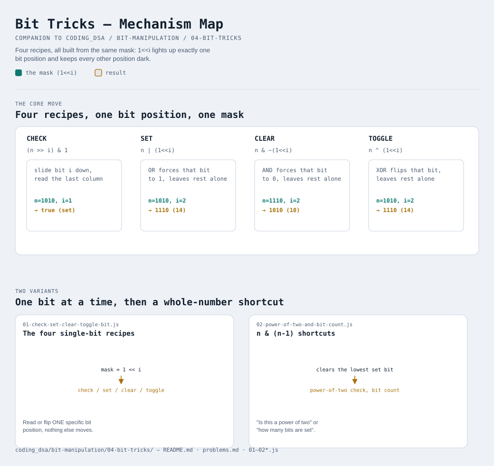

# Bit Tricks



Interactive version: [diagram.html](diagram.html) (open in a browser)

## This module is just modules 2 and 3, combined into recipes
Nothing new is being introduced here. Every trick below is AND, OR, XOR,
or shift, combined in a specific short way to answer one specific
question about ONE bit position. Once you've memorized these four (they
really are worth memorizing — they show up constantly), the rest of this
module is two bonus shortcuts built on top of them.

## The mask: `1 << i`
Every recipe below starts the same way — build a "mask" that has a `1` in
exactly ONE position (position `i`) and `0` everywhere else:

```
1 << 0 = 0000 0001   (mask for position 0)
1 << 3 = 0000 1000   (mask for position 3)
```

A mask is a spotlight: it lights up exactly the one bit you care about
and keeps every other position dark, which is what lets the operators
below touch ONE bit without disturbing any other.

## Check if bit `i` is set — `(n >> i) & 1`
Slide bit `i` down to the last position, then read just that last bit
with `& 1` (module 3's trick).

```
n = 0000 1010 (10), check bit 1:
n >> 1 = 0000 0101, & 1 = 1   → bit 1 IS set
```

## Set bit `i` to 1 — `n | (1 << i)`
OR's rule is "at least one is on" — OR-ing with a mask that has a `1`
only at position `i` forces that position to `1` no matter what it was,
and OR-ing with `0` everywhere else leaves every other position alone.

```
n = 0000 1010 (10), set bit 2:
n | (1<<2) = 0000 1010 | 0000 0100 = 0000 1110 (14)
```

## Clear bit `i` to 0 — `n & ~(1 << i)`
`~(1<<i)` flips the mask: `0` at position `i`, `1` everywhere else.
AND-ing with that forces position `i` to `0` (AND with `0` is always
`0`) while AND-ing with `1` everywhere else leaves those positions alone.

```
n = 0000 1110 (14), clear bit 2:
~(1<<2)     = 1111 1011
n & that    = 0000 1010 (10)
```

## Toggle bit `i` — `n ^ (1 << i)`
XOR's "flip if the mask says 1" behavior (module 2) does exactly this: a
mask with `1` only at position `i` flips just that position, and `0`
everywhere else leaves the rest untouched.

```
n = 0000 1010 (10), toggle bit 2:
n ^ (1<<2) = 0000 1010 ^ 0000 0100 = 0000 1110 (14)
```

## Bonus shortcut 1: is `n` a power of two? — `n > 0 && (n & (n - 1)) === 0`
A power of two in binary is a single `1` bit with nothing but `0`s after
it (`0100`, `1000`, ...). Subtracting `1` flips that single `1` to `0`
and turns every `0` after it into `1` (borrowing ripples through them):

```
  8 = 0000 1000
  7 = 0000 0111   (8 - 1: the 1 becomes 0, everything after becomes 1)
8&7 = 0000 0000   → 0, so 8 IS a power of two
```

For any number that ISN'T a power of two, there's more than one `1` bit,
so subtracting 1 can't flip ALL of them — `n & (n-1)` won't reach `0`.

## Bonus shortcut 2: count the `1` bits — Brian Kernighan's trick
The same `n & (n - 1)` move — instead of just checking if it reaches
zero, count how many times you can repeat it before it does. Each
repetition clears exactly the LOWEST `1` bit, so the number of
repetitions IS the number of `1` bits.

```
n = 0000 1010 (10)
n & (n-1) = 0000 1000  (cleared the lowest 1)      — 1 repetition
n & (n-1) = 0000 0000  (cleared the last 1)         — 2 repetitions
→ 10 has 2 set bits
```

## Two variants

| File | Variant | Use when |
|---|---|---|
| [01-check-set-clear-toggle-bit.js](01-check-set-clear-toggle-bit.js) | The four single-bit recipes | you need to read or flip ONE specific bit position |
| [02-power-of-two-and-bit-count.js](02-power-of-two-and-bit-count.js) | `n & (n-1)` shortcuts | checking "is this a power of two" or "how many bits are set" |

Each file is runnable standalone: `node 0X-name.js` prints a demo run.

See [problems.md](problems.md) for a suggested practice order.
