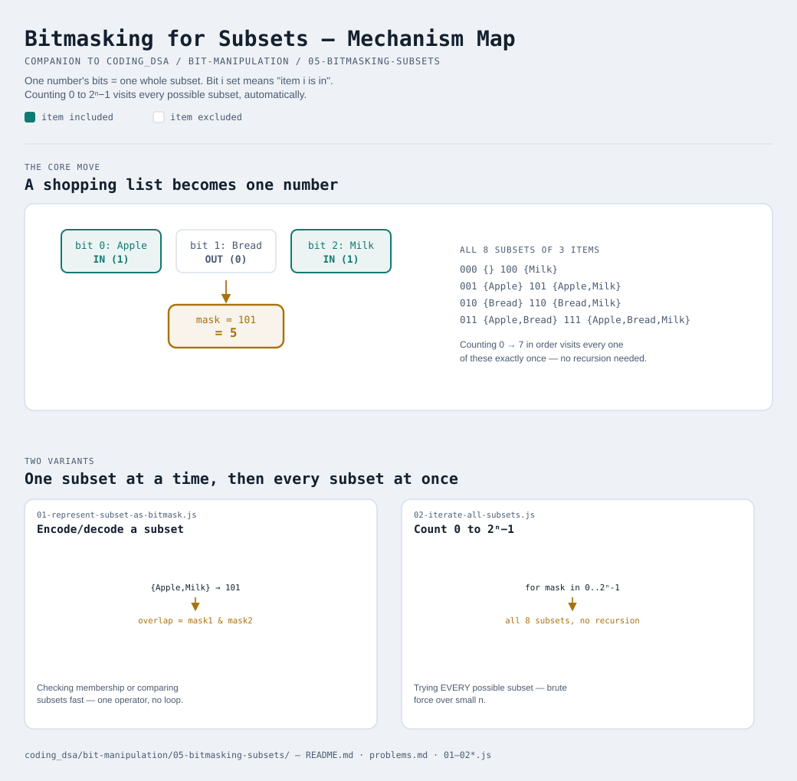

# Bitmasking for Subsets



Interactive version: [diagram.html](diagram.html) (open in a browser)

## The idea in one sentence
A single number's bits can represent "which items from a list are
included" — bit `i` set means "item `i` is in this group", bit `i` clear
means "item `i` is not". One number = one entire subset.

## The shopping list picture
Say you have 3 items: `[Apple, Bread, Milk]`. Line them up with item 0 on
the right (matching how binary is normally written):

```
bit position:   2      1      0
item:         Milk   Bread  Apple

Want Apple and Milk, but not Bread?
                1      0      1     = binary 101 = decimal 5
```

The number `5` doesn't just happen to relate to this subset — `5` **IS**
this subset, as long as everyone agrees what each bit position means.
"Decode" it any time with module 4's `checkBit` trick: bit 0 of `5` is
set → Apple's in; bit 1 is clear → Bread's out; bit 2 is set → Milk's in.

## Why bits, and not something like an array of booleans?
You could use `[true, false, true]` instead, and for a single subset
that's totally fine. Bitmasks earn their keep the moment you need to
**generate or compare many subsets at once** — which is almost always why
you'd reach for this trick in practice:
- Comparing two subsets for overlap becomes one `&`, not a loop
- Combining two subsets becomes one `|`, not a loop
- **Generating every possible subset of `n` items becomes counting from
  `0` to `2^n - 1`** — because every number in that range, written in
  binary, IS a different combination of included/excluded items

## Why counting 0 to 2ⁿ−1 gives every subset
With `n` items, there are `n` independent yes/no decisions (in or out),
so there are `2^n` total combinations — exactly the count of binary
numbers you can write with `n` digits, from `000...0` up to `111...1`.
Counting through that range in order visits every combination exactly
once, automatically, with no recursion, no backtracking, and no risk of
missing one:

```
000 = {}                100 = {Milk}
001 = {Apple}           101 = {Apple, Milk}
010 = {Bread}           110 = {Bread, Milk}
011 = {Apple, Bread}    111 = {Apple, Bread, Milk}
```

That's all 8 (`2³`) possible subsets of 3 items, including the empty set
`{}` and the full set `{Apple, Bread, Milk}`.

## How this connects to earlier patterns in this repo
[17-subsets-backtracking](../../17-subsets-backtracking/README.md) solves
"generate every subset" with recursion — build a partial subset, recurse
with the item included, recurse again without it. A bitmask loop does the
exact same enumeration with a single `for` loop and zero function calls —
worth knowing both, since interviewers sometimes ask for the
non-recursive version specifically.

## Two variants

| File | Variant | Use when |
|---|---|---|
| [01-represent-subset-as-bitmask.js](01-represent-subset-as-bitmask.js) | Encode/decode a subset as a number | you need to check membership or compare subsets fast |
| [02-iterate-all-subsets.js](02-iterate-all-subsets.js) | Count 0 to 2ⁿ−1 | you need to try EVERY possible subset (brute force over small `n`) |

Each file is runnable standalone: `node 0X-name.js` prints a demo run.

See [problems.md](problems.md) for a suggested practice order.

## You made it
That's the whole track. If modules 1-5 all clicked, go see the payoff:
[18-bitwise-xor](../../18-bitwise-xor/README.md) — an interview pattern
built entirely out of the identities from
[02-bitwise-operators](../02-bitwise-operators/README.md).
