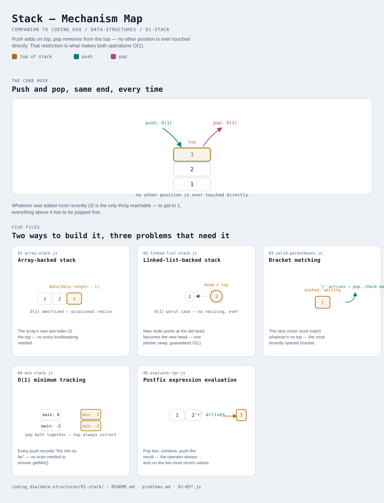

# Stack

Interactive version: [diagram.html](diagram.html) (open in a browser)

## What
- A collection where every operation — push, pop, peek — happens at ONE
  end, called the top. Last in, first out (LIFO)
- Two ways to build one (variants 1-2), and three classic problems that
  are natural fits for it once you recognize the "most recent thing
  matters most" shape (variants 3-5)
- Not the same module as [07-monotonic-stack](../../07-monotonic-stack/README.md) —
  that pattern USES a stack (kept in sorted order) to answer nearest-greater/
  smaller queries; this module is the stack itself, from scratch

## When to use it
Reach for a stack when:
1. Order needs to unwind in the exact reverse of how it was built — undo
   history, function call frames, backtracking state
2. Matching nested structure — every closer must pair with the most
   recently seen unmatched opener (brackets, tags, nested scopes)
3. An expression or process needs the MOST RECENT unfinished piece
   available immediately — postfix evaluation, DFS via an explicit stack
   instead of recursion

## Why it works
- Restricting access to one end is what makes push/pop O(1) — no need to
  shift other elements or search for anything, the top is always known
- Array-backed (variant 1): push/pop at the end is O(1) amortized: the
  underlying buffer occasionally resizes and copies, but rarely enough
  that the average stays O(1)
- Linked-list-backed (variant 2): push/pop at the head is O(1) WORST
  CASE, no resizing ever — at the cost of a pointer per element and worse
  cache locality

## Five files
Two ways to build the structure, three problems that are natural
applications of it.

| File | What it is | Use when |
|---|---|---|
| [01-array-stack.js](01-array-stack.js) | Array-backed stack | the default choice — O(1) amortized, better cache locality |
| [02-linked-list-stack.js](02-linked-list-stack.js) | Linked-list-backed stack | O(1) WORST CASE matters more than average-case speed |
| [03-valid-parentheses.js](03-valid-parentheses.js) | Bracket matching | the closer must match the most recently opened bracket |
| [04-min-stack.js](04-min-stack.js) | O(1) minimum tracking | a second stack, kept in lockstep, avoids scanning for the min |
| [05-evaluate-rpn.js](05-evaluate-rpn.js) | Postfix expression evaluation | an operator always combines the two most recently computed values |

Each file is runnable standalone: `node 0X-name.js` prints a demo run.

See [problems.md](problems.md) for a suggested practice order.
