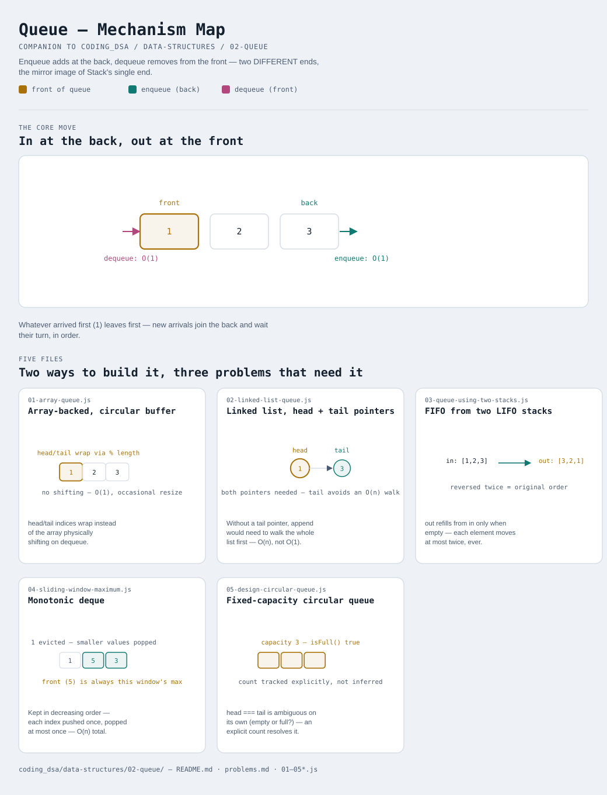

# Queue

Interactive version: [diagram.html](diagram.html) (open in a browser)

## What
- A collection where elements enter at one end (the back) and leave from
  the other (the front). First in, first out (FIFO) — the mirror image
  of [Stack](../01-stack/README.md)'s LIFO
- Two ways to build one (variants 1-2), plus three classic problems that
  are natural fits once the "process things in the order they arrived"
  shape is recognized (variants 3-5)
- A deque (double-ended queue, variant 4) generalizes this further —
  push/pop are allowed at BOTH ends, which is what makes a monotonic
  window-maximum trick possible at all

## When to use it
Reach for a queue when:
1. Work needs to be processed in the exact order it arrived — task
   scheduling, BFS level-by-level traversal, request buffering
2. Two operations need to be decoupled — a producer that adds and a
   consumer that removes, at their own paces, in arrival order
3. A "most recent unfinished piece" is the WRONG shape for the problem
   (that's a stack) but "oldest unfinished piece" is exactly right

## Why it works
- Restricting entry to one end and exit to the other is what makes both
  operations O(1) — no shifting, no searching, front and back are always
  known
- Array-backed (variant 1): a circular buffer avoids the O(n) cost of
  physically shifting elements left every time the front is removed —
  head and tail just wrap around via modulo
- Linked-list-backed (variant 2): O(1) worst case with no resize step
  ever, at the cost of a pointer per element — the same trade-off as
  Stack's two variants, mirrored

## Five files
Two ways to build the structure, three problems that are natural
applications of it.

| File | What it is | Use when |
|---|---|---|
| [01-array-queue.js](01-array-queue.js) | Array-backed, circular buffer | the default choice — O(1) amortized, better cache locality |
| [02-linked-list-queue.js](02-linked-list-queue.js) | Linked-list-backed, head + tail pointers | O(1) WORST CASE matters more than average-case speed |
| [03-queue-using-two-stacks.js](03-queue-using-two-stacks.js) | FIFO built from two LIFO stacks | only a stack primitive is available, but queue behavior is needed |
| [04-sliding-window-maximum.js](04-sliding-window-maximum.js) | Monotonic deque | the max (or min) of every fixed-size window, in O(n) total |
| [05-design-circular-queue.js](05-design-circular-queue.js) | Fixed-capacity circular queue | a hard capacity limit is part of the problem, not just an implementation detail |

Each file is runnable standalone: `node 0X-name.js` prints a demo run.

See [problems.md](problems.md) for a suggested practice order.
