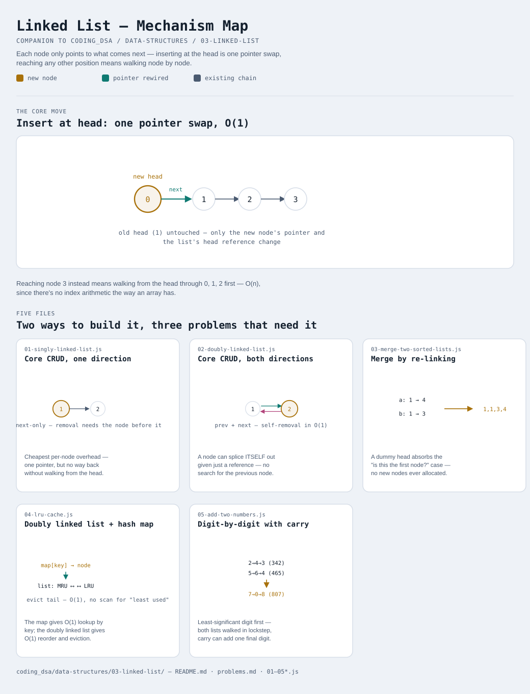

# Linked List

Interactive version: [diagram.html](diagram.html) (open in a browser)

## What
- A chain of nodes, each holding a value and a pointer to the next node
  (singly) or to both the next AND previous node (doubly). No contiguous
  memory block, no index arithmetic — reaching node i always means
  walking i steps from the head
- Both [Stack](../01-stack/README.md) and [Queue](../02-queue/README.md)'s
  linked-list-backed variants are already built on this same node shape —
  this module is where CRUD on that shape gets built out fully
- Reversal and cycle detection are deliberately NOT re-covered here —
  they're already full pattern modules:
  [06-in-place-linked-list-reversal](../../06-in-place-linked-list-reversal/README.md)
  and [03-fast-slow-pointers](../../03-fast-slow-pointers/README.md)

## When to use it
Reach for a linked list when:
1. Insertion/removal at the front (or at an already-held node reference)
   needs to be O(1), and random access by index is not needed
2. The final size isn't known ahead of time and frequent inserts would
   otherwise trigger expensive array resizing
3. A node needs to remove ITSELF in O(1) given only a reference to it —
   this needs the doubly linked variant specifically (see variant 4,
   LRU Cache, for exactly why)

## Why it works
- Singly linked (variant 1): each node only knows what comes after it —
  cheap (one pointer per node), but removing a node requires the node
  BEFORE it, which usually means walking from the head, O(n)
- Doubly linked (variant 2): each node also knows what comes before it —
  a node can be spliced out in O(1) given just a reference to itself, at
  the cost of a second pointer per node and more bookkeeping on every
  insert/delete

## Five files
Two ways to build the structure, three problems that are natural
applications of it.

| File | What it is | Use when |
|---|---|---|
| [01-singly-linked-list.js](01-singly-linked-list.js) | Core CRUD, one direction | the default choice — cheapest per-node overhead |
| [02-doubly-linked-list.js](02-doubly-linked-list.js) | Core CRUD, both directions | O(1) removal of an already-held node reference is needed |
| [03-merge-two-sorted-lists.js](03-merge-two-sorted-lists.js) | Merge by re-linking | two sorted lists need to become one, without extra allocation |
| [04-lru-cache.js](04-lru-cache.js) | Doubly linked list + hash map | O(1) get/put with least-recently-used eviction |
| [05-add-two-numbers.js](05-add-two-numbers.js) | Digit-by-digit traversal with carry | a number too large for a normal integer type, stored digit-per-node |

Each file is runnable standalone: `node 0X-name.js` prints a demo run.

See [problems.md](problems.md) for a suggested practice order.
