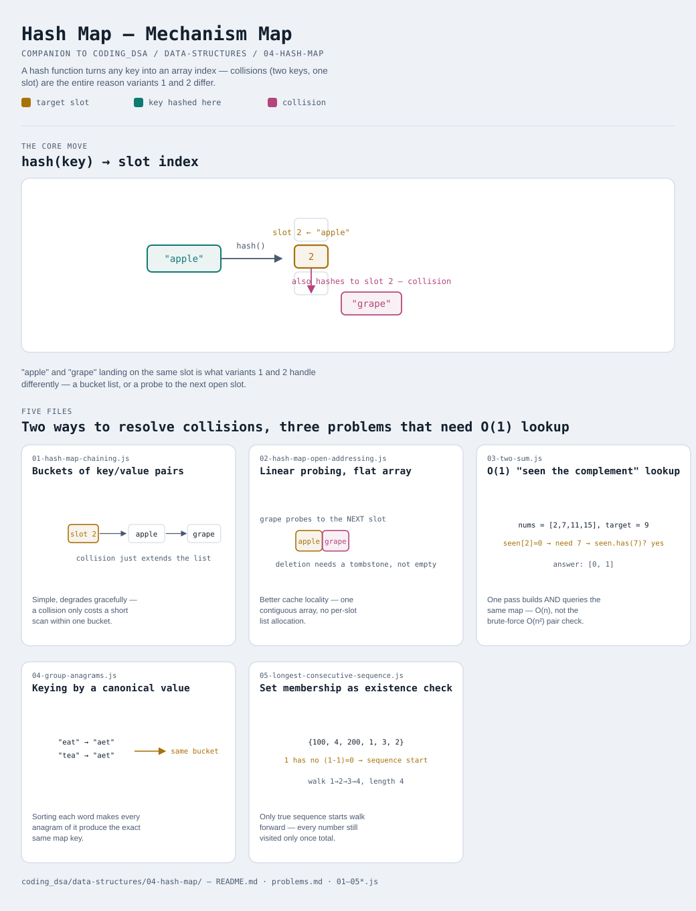

# Hash Map

Interactive version: [diagram.html](diagram.html) (open in a browser)

## What
- A structure that converts a key into an array index via a hash
  function, giving O(1) average-case get/put/delete without needing keys
  to be sortable, numeric, or bounded in range — unlike
  [Cyclic Sort](../../05-cyclic-sort/README.md), which needs values in a
  known [1..n] range to use array indices directly
- Two ways to resolve collisions — two DIFFERENT keys landing on the
  same slot — (variants 1-2), plus three classic applications built on
  O(1) average lookup (variants 3-5)
- [04-lru-cache.js](../03-linked-list/04-lru-cache.js) in the Linked List
  module already used a hash map as half of its mechanism — this module
  is where that structure itself gets built

## When to use it
Reach for a hash map when:
1. O(1) average lookup, insertion, or deletion by key is needed, and
   keys aren't naturally array indices
2. "Have I seen this before?" needs to be answered in O(1) instead of
   scanning what's been seen so far — turns an O(n²) pairwise check into
   O(n) (variant 3)
3. Items need to be grouped or counted by some derived property, not
   their literal value (variant 4)

## Why it works
- Average-case O(1) relies on the hash function spreading keys roughly
  evenly across slots, and on the load factor (entries ÷ capacity)
  staying low via resizing — a bad hash function or a full table
  degrades every operation toward O(n)
- Chaining (variant 1): each slot holds a small list; collisions just
  extend that list. Simple, and degrades gracefully — a collision only
  costs a short scan within one bucket
- Open addressing (variant 2): every key lives directly in the flat
  array itself; collisions probe forward to the next slot. Better cache
  locality, but deletion needs a tombstone marker so later keys that
  probed past a deleted slot stay reachable

## Five files
Two ways to resolve collisions, three problems that are natural
applications of O(1) average lookup.

| File | What it is | Use when |
|---|---|---|
| [01-hash-map-chaining.js](01-hash-map-chaining.js) | Buckets of [key, value] pairs | the default choice — simple, degrades gracefully under collisions |
| [02-hash-map-open-addressing.js](02-hash-map-open-addressing.js) | Linear probing, flat array | cache locality matters more than deletion simplicity |
| [03-two-sum.js](03-two-sum.js) | O(1) "have I seen the complement" lookup | a pairwise sum condition needs checking without O(n²) comparisons |
| [04-group-anagrams.js](04-group-anagrams.js) | Keying by a transformed/canonical value | grouping by a derived property, not the literal value |
| [05-longest-consecutive-sequence.js](05-longest-consecutive-sequence.js) | Set membership as an O(1) existence check | the longest run needs finding without sorting first |

Each file is runnable standalone: `node 0X-name.js` prints a demo run.

See [problems.md](problems.md) for a suggested practice order.
