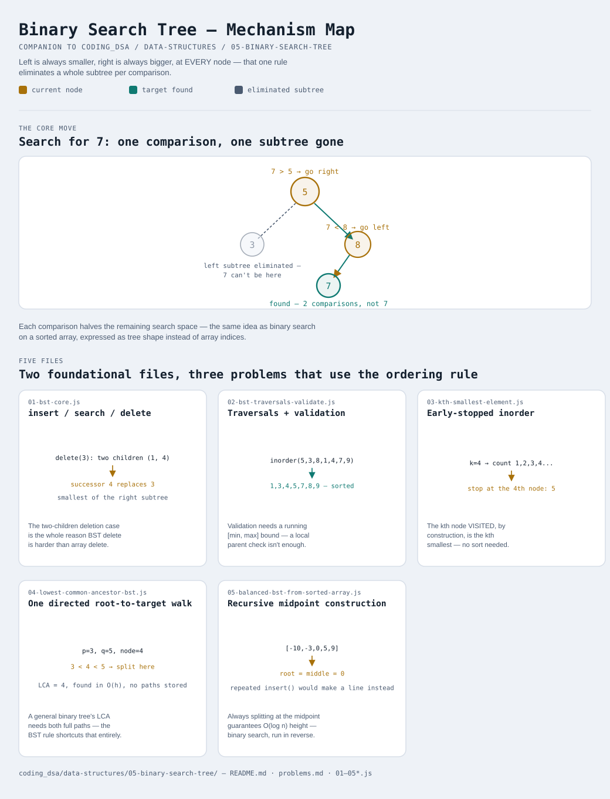

# Binary Search Tree

Interactive version: [diagram.html](diagram.html) (open in a browser)

## What
- A binary tree with one rule enforced at every single node: everything
  in the left subtree is smaller, everything in the right subtree is
  bigger. That rule alone is what turns search into a binary search
- Not a heap — a heap/priority queue (see [../index.md](../index.md), not
  yet built) only guarantees a parent beats its children, which is
  weaker and cheaper to maintain, but doesn't give sorted traversal order
  the way a BST does
- Two foundational files (core CRUD, then traversals/validation), plus
  three classic problems that lean directly on the ordering rule

## When to use it
Reach for a BST when:
1. Insert, search, AND delete all need to be faster than O(n), and —
   unlike a [Hash Map](../04-hash-map/README.md) — the SORTED order of
   elements matters too (range queries, "next largest", inorder output)
2. Data arrives incrementally and needs to stay queryable in sorted
   order the whole time, not just once at the end
3. A problem states or implies the tree is already a valid BST — that
   assumption unlocks O(h) algorithms (variant 4) that a general binary
   tree can't use

## Why it works
- At every node, comparing the target against that node's value
  eliminates an entire subtree — the same halving idea as binary search
  on a sorted array, expressed as tree structure instead of array
  indices
- Search, insert, and delete are all O(h), where h is the tree's
  height — O(log n) if the tree stays balanced, but O(n) in the worst
  case if it degenerates into a line (exactly what happens when
  inserting already-sorted data one value at a time — see variant 5 for
  the fix)
- Deletion has three cases, and the hardest (a node with two children)
  is resolved by swapping in the INORDER SUCCESSOR — the smallest value
  in the right subtree — which is guaranteed to preserve the ordering
  rule everywhere else in the tree

## Five files
Two foundational files, three problems that are natural applications of
the ordering rule.

| File | What it is | Use when |
|---|---|---|
| [01-bst-core.js](01-bst-core.js) | insert / search / delete | the foundation — all three of BST's core operations, including the two-children deletion case |
| [02-bst-traversals-validate.js](02-bst-traversals-validate.js) | inorder/preorder/postorder + validation | sorted output is needed directly from traversal, or a tree's BST property needs confirming |
| [03-kth-smallest-element.js](03-kth-smallest-element.js) | Early-stopped inorder traversal | the kth smallest value is needed without a full sort |
| [04-lowest-common-ancestor-bst.js](04-lowest-common-ancestor-bst.js) | One directed root-to-target walk | LCA in a KNOWN BST — the ordering rule shortcuts what a general tree needs both full paths for |
| [05-balanced-bst-from-sorted-array.js](05-balanced-bst-from-sorted-array.js) | Recursive midpoint construction | a sorted array needs to become a height-balanced BST, not whatever shape repeated insert() produces |

Each file is runnable standalone: `node 0X-name.js` prints a demo run.

See [problems.md](problems.md) for a suggested practice order.
