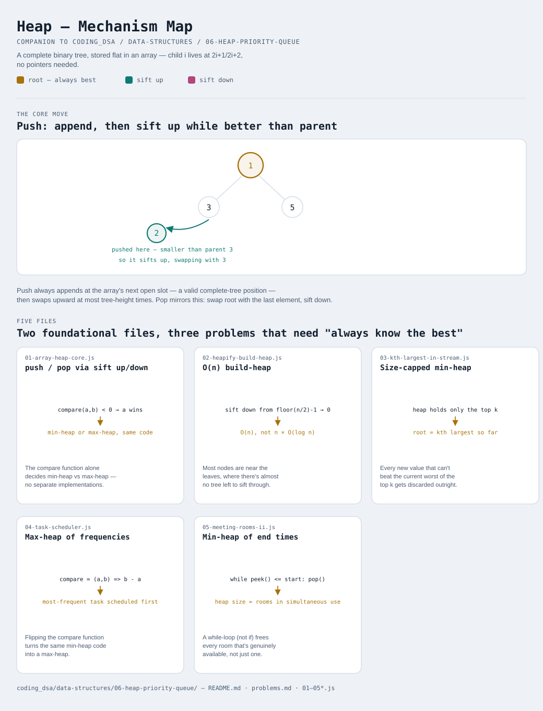

# Heap / Priority Queue

Interactive version: [diagram.html](diagram.html) (open in a browser)

## What
- A complete binary tree stored flat in an array — no pointers. Index i's
  children live at `2i+1` and `2i+2`, its parent at `floor((i-1)/2)`, so
  the tree shape is implicit in index arithmetic, not stored explicitly
- A heap only promises the ROOT is the best element (by whatever compare
  function is given) — nothing else is guaranteed sorted, which is
  exactly what makes push/pop cheaper than keeping a fully sorted structure
- This exact `Heap(compare)` class is what
  [13-two-heaps](../../13-two-heaps/README.md),
  [14-top-k-elements](../../14-top-k-elements/README.md), and
  [15-k-way-merge](../../15-k-way-merge/README.md) all build on top of —
  this module is where it gets built and explained on its own, so its
  three application files deliberately pick problems NOT already covered
  by those pattern modules (or by heap sort in
  [00-sorting-algorithms](../../00-sorting-algorithms/README.md))

## When to use it
Reach for a heap when:
1. The minimum/maximum needs finding and removing repeatedly, faster
   than an O(n) scan each time, but full sorted order is never needed
2. Only the top k of a stream matters, and keeping all n values around
   (to sort them later) would waste memory and time
3. A greedy algorithm needs "the best remaining option" re-evaluated
   after every step — task scheduling, room allocation, Dijkstra's
   shortest path

## Why it works
- Push appends at the array's next open slot (always a valid complete-tree
  position) then SIFTS UP — swap with its parent while it's better,
  O(log n) since a complete tree has height O(log n)
- Pop swaps the root with the LAST element, removes the old root, then
  SIFTS DOWN from the root — O(log n). Swapping in the last element
  (not just deleting the root) is what keeps the tree complete; removing
  from the middle would leave a hole array indexing can't represent
- Building a heap from an existing array (heapify) is O(n), not
  O(n log n) — sifting down from the bottom half concentrates the real
  work near the leaves, where there's almost no tree left to sift
  through (see variant 2)

## Five files
Two foundational files, three problems that are natural applications —
chosen specifically to NOT duplicate what 13/14/15 or heap sort already cover.

| File | What it is | Use when |
|---|---|---|
| [01-array-heap-core.js](01-array-heap-core.js) | push / pop / peek via sift-up/sift-down | the foundation — a generic compare-based heap, min or max |
| [02-heapify-build-heap.js](02-heapify-build-heap.js) | O(n) build-heap from an existing array | the data already exists as an array, not arriving one push() at a time |
| [03-kth-largest-in-stream.js](03-kth-largest-in-stream.js) | Size-capped min-heap | the kth largest needs answering after EVERY new streamed value, not just once |
| [04-task-scheduler.js](04-task-scheduler.js) | Max-heap of frequencies + cooldown simulation | repeated work needs scheduling with a mandatory gap between repeats |
| [05-meeting-rooms-ii.js](05-meeting-rooms-ii.js) | Min-heap of end times | minimum concurrent resources (rooms) needed to cover overlapping intervals |

Each file is runnable standalone: `node 0X-name.js` prints a demo run.

See [problems.md](problems.md) for a suggested practice order.
