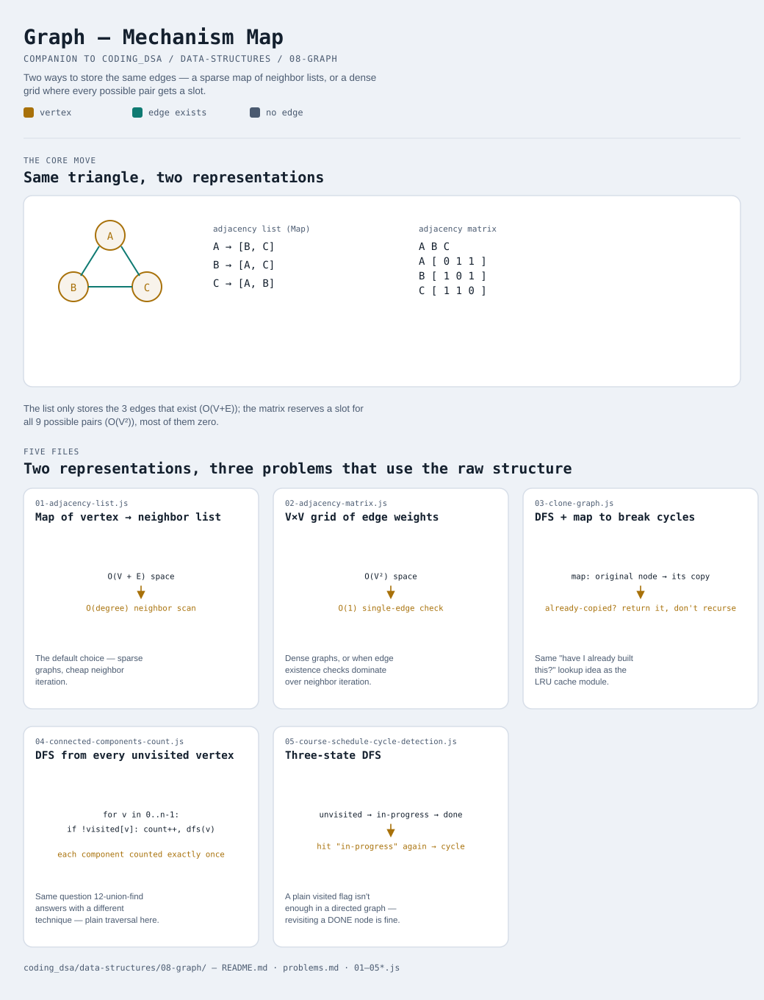

# Graph

Interactive version: [diagram.html](diagram.html) (open in a browser)

## What
- Two ways to represent the same thing — vertices and the edges between
  them — as a sparse map (variant 1) or a dense grid (variant 2). Every
  other graph pattern module in this repo assumes one of these already
  exists
- This module deliberately does NOT re-cover BFS/DFS traversal, Kahn's
  algorithm, or union-find — those are full pattern modules already:
  [10-graph-bfs-dfs](../../10-graph-bfs-dfs/README.md),
  [11-topological-sort](../../11-topological-sort/README.md),
  [12-union-find](../../12-union-find/README.md). This module's three
  applications were picked specifically because they lean on the RAW
  representation itself, not on re-explaining those patterns
- [27-graph-shortest-path](../../index.md) (Dijkstra/Bellman-Ford, not
  yet built) is the other major graph pattern still pending — it too
  will assume this module's representation

## When to use it
Reach for a graph when:
1. Relationships between items matter more than any single item's
   value — networks, dependencies, maps, social connections
2. The number of connections per item varies wildly (some vertices have
   1 neighbor, others have hundreds) — pick adjacency list
3. Checking "are these two specific things connected?" happens far more
   often than "what are all of this thing's connections?" — pick
   adjacency matrix instead

## Why it works
- Adjacency list: O(V + E) space, O(degree) to list one vertex's
  neighbors, O(degree) to check one specific edge — cheap for the
  common case of a SPARSE graph, where most possible pairs aren't
  connected
- Adjacency matrix: O(V²) space regardless of edge count, O(1) to check
  one specific edge, O(V) to list a vertex's neighbors (the whole row
  has to be scanned, zeros included) — cheap for DENSE graphs or
  edge-existence-heavy workloads
- Neither representation is "better" in general — the choice depends
  entirely on which operation (listing neighbors vs. checking one edge)
  the actual workload does more often

## Five files
Two representations, three problems that are natural applications of
the raw structure itself.

| File | What it is | Use when |
|---|---|---|
| [01-adjacency-list.js](01-adjacency-list.js) | Map of vertex → neighbor list | the default choice — sparse graphs, cheap neighbor iteration |
| [02-adjacency-matrix.js](02-adjacency-matrix.js) | V×V grid of edge weights | dense graphs, or edge-existence checks dominate |
| [03-clone-graph.js](03-clone-graph.js) | DFS + map to break cycles while copying | a full independent deep copy of a graph (with cycles) is needed |
| [04-connected-components-count.js](04-connected-components-count.js) | DFS from every unvisited vertex | counting separate connected pieces, via traversal instead of union-find |
| [05-course-schedule-cycle-detection.js](05-course-schedule-cycle-detection.js) | Three-state DFS (unvisited/in-progress/done) | detecting a cycle in a DIRECTED graph, via DFS instead of Kahn's algorithm |

Each file is runnable standalone: `node 0X-name.js` prints a demo run.

See [problems.md](problems.md) for a suggested practice order.
