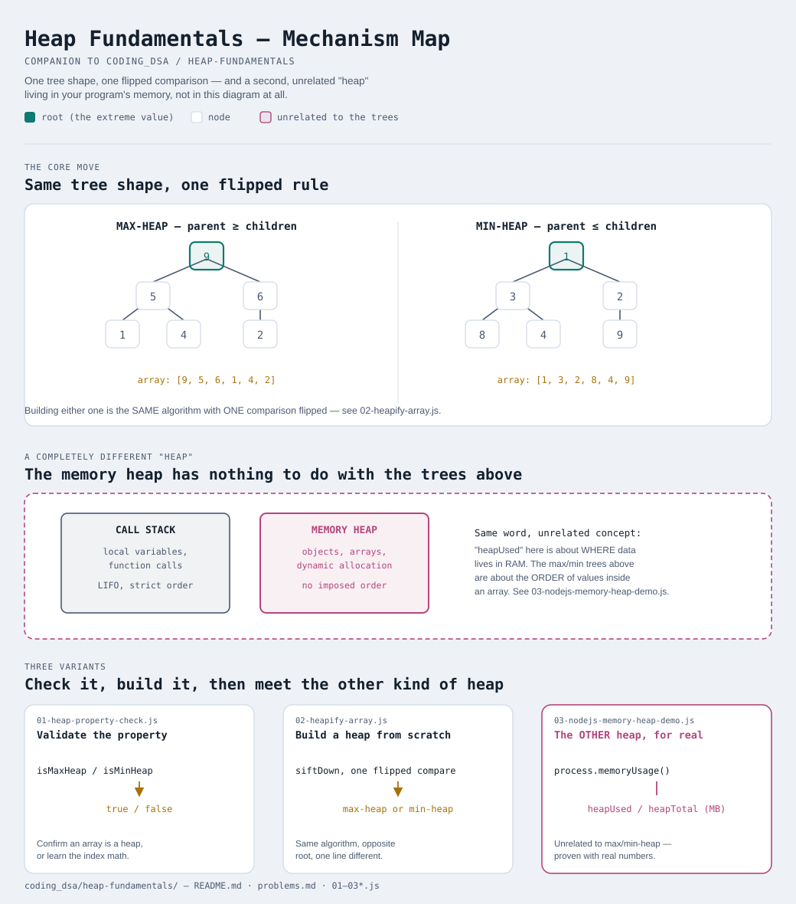

# Heap Fundamentals



Interactive version: [diagram.html](diagram.html) (open in a browser)

A one-stop page for the two things about heaps that confuse almost
everyone at first: what tells a max-heap apart from a min-heap, and why
"heap" also refers to something completely unrelated in memory
management. For the full from-scratch build (insert, extract, sift-up,
sift-down as a reusable class), see
[data-structures/06-heap-priority-queue](../data-structures/06-heap-priority-queue/README.md) —
this page is the concept primer that belongs before that, and before the
patterns that use a heap as a tool
([13-two-heaps](../13-two-heaps/README.md),
[14-top-k-elements](../14-top-k-elements/README.md),
[15-k-way-merge](../15-k-way-merge/README.md)).

## What a heap (the data structure) actually is
A heap is a **complete binary tree** (every level full except possibly
the last, which fills left to right) that obeys ONE local rule, the
**heap property**, at every parent/child relationship. That's the entire
definition — no rule about how left compares to right, no rule about
sibling order, nothing global. Just: does every parent satisfy the rule
against its own children?

Because the tree is always "complete" in this specific way, it can be
stored as a plain array with no pointers at all:

```
parent of index i  = (i - 1) / 2   (rounded down)
left child of i    = 2*i + 1
right child of i   = 2*i + 2
```

## Max-heap: parent ≥ both children
Every parent is greater than or equal to its children, all the way down.
The consequence: **the biggest value in the whole structure is always at
the root** — index 0.

```
        9
      /   \
     5     6
    / \   /
   1   4 2

array form: [9, 5, 6, 1, 4, 2]
```

## Min-heap: parent ≤ both children
The mirror image — every parent is less than or equal to its children,
so **the smallest value is always at the root**.

```
        1
      /   \
     3     2
    / \   /
   8   4 9

array form: [1, 3, 2, 8, 4, 9]
```

## The only difference between building the two
Look closely at [02-heapify-array.js](02-heapify-array.js): `buildMaxHeap`
and `buildMinHeap` are the exact same function, except one comparison is
flipped (`a - b` vs `b - a`). Every other line — the loop, the swapping,
the traversal order — is identical. "Max-heap vs min-heap" isn't two
different data structures; it's one data structure with a direction knob.

| | Max-heap | Min-heap |
|---|---|---|
| Root holds | the largest value | the smallest value |
| Parent rule | parent ≥ children | parent ≤ children |
| Use when you need | "give me the biggest, repeatedly" | "give me the smallest, repeatedly" |
| Classic use | scheduling by highest priority, top-K largest | Dijkstra's algorithm, top-K smallest, merging sorted lists |

## "Heap" (the data structure) vs "the heap" (memory) — these are NOT the same thing
This is the single most common point of confusion for anyone learning
this topic, and it's worth being blunt about: **the word "heap" is used
for two totally unrelated concepts in computer science, and neither one
explains or depends on the other.**

**The heap (data structure)** — everything above on this page. A
tree-shaped arrangement of VALUES you build and query yourself, obeying
the max/min property, usually backed by an array you can see and reason
about in your own code.

**The heap (memory)** — a region of a running program's memory set aside
for data whose size or lifetime isn't known until the program is
actually running (as opposed to **the stack**, which handles function
calls and short-lived local variables in a strict, predictable
last-in-first-out order). When you write `new Something()` in
JavaScript/Java, or call `malloc()` in C, the memory you get typically
comes from this region. It's managed automatically in JavaScript (the
garbage collector reclaims it), manually in C (you call `free()`
yourself). [03-nodejs-memory-heap-demo.js](03-nodejs-memory-heap-demo.js)
shows Node reporting on exactly this — `heapUsed` and `heapTotal` have
nothing whatsoever to do with whether any array in your program happens
to satisfy the max-heap or min-heap property.

Why does the SAME word cover both? Genuinely just an English-language
coincidence, not a technical relationship — "heap" in plain English
means "an unordered pile of things" (a heap of laundry), and both
concepts got that name independently: the memory region because
allocated blocks pile up there with no imposed order, and the tree
structure — despite having a very strict internal order — happened to
get the same word when it was named in the 1960s. If it helps, some
languages/textbooks avoid the collision entirely by calling the tree
structure a "priority queue" instead and reserving "heap" only for the
memory sense — this repo (and most interview material) uses "heap" for
both, so the distinction has to be carried in your head, not in the word.

| | Heap (data structure) | Heap (memory) |
|---|---|---|
| What it is | a tree with an ordering rule | a region of runtime memory |
| Who manages it | your code, explicitly | the runtime/OS, mostly automatically |
| You interact via | `insert`, `extractMax`, array indices | `new`, `malloc`, object literals |
| Vocabulary | "heapify", "max-heap", "sift-down" | "heap overflow", "out of memory", "heapUsed" |
| Does one require the other? | No — a heap (structure) doesn't have to live in the memory heap, and most heap-allocated memory has no ordering property at all | |

## Three variants

| File | Variant | Use when |
|---|---|---|
| [01-heap-property-check.js](01-heap-property-check.js) | Validate the max/min property | you need to confirm an array actually is a heap, or understand the index math |
| [02-heapify-array.js](02-heapify-array.js) | Build a heap from an unsorted array | turning arbitrary data into a max-heap or min-heap, seeing that they're one algorithm with a flipped comparison |
| [03-nodejs-memory-heap-demo.js](03-nodejs-memory-heap-demo.js) | The OTHER heap, made concrete | seeing real `heapUsed`/`heapTotal` numbers that have nothing to do with the max/min property above |

Each file is runnable standalone: `node 0X-name.js` prints a demo run.

See [problems.md](problems.md) for a suggested practice order.
