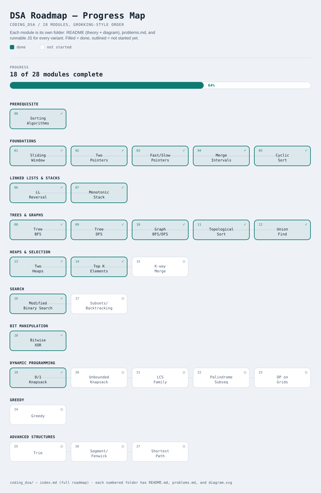

# DSA Roadmap

Interactive version (live): [rishurishabh.github.io/coding-dsa/roadmap.html](https://rishurishabh.github.io/coding-dsa/roadmap.html)
(click any done pattern to jump to its README — the [roadmap.html](roadmap.html)
link here just shows as source code on GitHub, since it doesn't run the script)

Pattern-based roadmap (not "topic-based"). Each pattern solves a *family* of
problems with one reusable technique. Work top to bottom — later patterns
occasionally reuse earlier ones (e.g. Sliding Window uses Two Pointers).

Legend: `[ ]` not started · `[~]` in progress · `[x]` done

## Prerequisite
- [x] 00. [Sorting Algorithms](00-sorting-algorithms/README.md) — bubble/selection/insertion/merge/quick/heap/counting sort

## Foundations
- [x] 01. [Sliding Window](01-sliding-window/README.md) — contiguous subarray/substring, O(n) via expand+shrink
- [x] 02. [Two Pointers](02-two-pointers/README.md) — opposite-end convergence, read/write, partition, k-sum
- [x] 03. [Fast & Slow Pointers](03-fast-slow-pointers/README.md) — cycle detection, middle-of-list, Floyd's algorithm
- [x] 04. [Merge Intervals](04-merge-intervals/README.md) — overlapping ranges, scheduling
- [x] 05. [Cyclic Sort](05-cyclic-sort/README.md) — array with values in range [1..n], find missing/duplicate

## Linked Lists & Stacks
- [x] 06. [In-place Linked List Reversal](06-in-place-linked-list-reversal/README.md) — reverse whole/sub-list without extra space
- [x] 07. [Monotonic Stack](07-monotonic-stack/README.md) — next greater/smaller element, histogram problems

## Trees & Graphs
- [x] 08. [Tree BFS](08-tree-bfs/README.md) — level-order traversal
- [x] 09. [Tree DFS](09-tree-dfs/README.md) — path sum, root-to-leaf problems
- [x] 10. [Graph BFS/DFS](10-graph-bfs-dfs/README.md) — connected components, grid traversal
- [x] 11. [Topological Sort](11-topological-sort/README.md) — dependency ordering (DAGs)
- [x] 12. [Union Find (Disjoint Set)](12-union-find/README.md) — dynamic connectivity, Kruskal's MST

## Heaps & Selection
- [x] 13. [Two Heaps](13-two-heaps/README.md) — running median, balance-two-sides problems
- [x] 14. [Top K Elements](14-top-k-elements/README.md) — heap-based K largest/smallest/frequent
- [x] 15. [K-way Merge](15-k-way-merge/README.md) — merge K sorted lists/arrays

## Search
- [x] 16. [Modified Binary Search](16-modified-binary-search/README.md) — search in rotated/unknown-bound arrays
- [x] 17. [Subsets / Backtracking](17-subsets-backtracking/README.md) — permutations, combinations, N-Queens, Sudoku

## Bit Manipulation
- [x] 18. [Bitwise XOR](18-bitwise-xor/README.md) — single number, missing number tricks

## Dynamic Programming
- [x] 19. [0/1 Knapsack](19-01-knapsack/README.md) — subset sum, partition, target sum
- [x] 20. [Unbounded Knapsack](20-unbounded-knapsack/README.md) — coin change, rod cutting
- [x] 21. [LCS family](21-lcs-family/README.md) — edit distance, longest common/increasing subsequence
- [ ] 22. Palindromic Subsequence — interval DP
- [ ] 23. DP on Grids — unique paths, min path sum

## Greedy
- [ ] 24. Greedy — interval scheduling, jump game

## Advanced Structures (as needed)
- [ ] 25. Trie — prefix search, autocomplete
- [ ] 26. Segment Tree / Fenwick Tree — range query + update
- [ ] 27. Graph Shortest Path — Dijkstra, Bellman-Ford

## Conventions for this repo
- Language: JavaScript (Node, plain `.js`, `module.exports` + inline demo run).
- Each pattern gets its own numbered folder: `README.md` (how/when/why) +
  one file per variant + `problems.md` (practice list).
- Run any file directly: `node 01-sliding-window/01-fixed-size.js`.

## Data Structures track
The 27 patterns above assume familiarity with the underlying data
structures. **[data-structures/index.md](data-structures/index.md)** is a
separate track that builds those structures from scratch — same
README/problems.md/diagram convention, starting with
[Stack](data-structures/01-stack/README.md).
